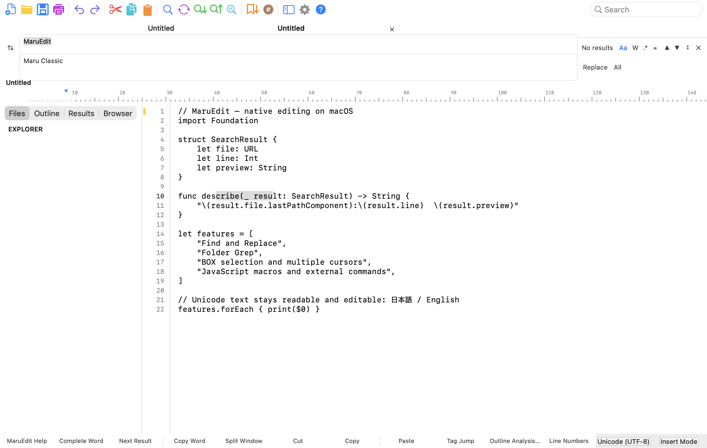
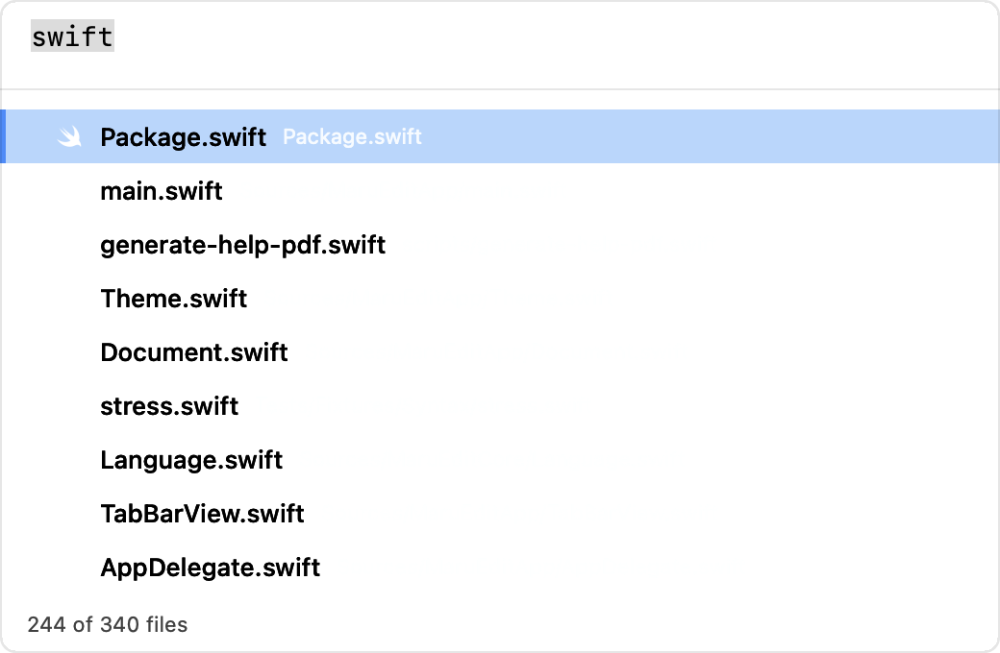

# MaruEdit

**The AI-native text editor for developers.**

MaruEdit is a fast, native text and code editor for macOS, built for modern developer workflows. It combines AppKit performance with a keyboard-focused **Maru Classic** workspace: a configurable command toolbar, tabs, horizontal ruler, utility pane, function-key strip, and a compact status area designed for long editing sessions.


[](LICENSE)
[](https://github.com/tosnetwork/maruedit/releases/latest)

**[Releases](https://github.com/tosnetwork/maruedit/releases)** · **[User guide](docs/user-guide.md)** · **[Command catalog](docs/commands.md)** · **[Roadmap](ROADMAP.md)**

## The editor today


The default workspace keeps frequently used operations visible without turning the editor into an IDE. Toolbar items, menus, key bindings, function keys, status fields, fonts, colors, wrapping, and file-type behavior can all be adjusted.

<table>
  <tr>
    <td width="50%"></td>
    <td width="50%"></td>
  </tr>
  <tr>
    <td align="center">Find and Replace</td>
    <td align="center">Quick Open</td>
  </tr>
</table>

Additional Classic workspace states—including light/dark appearance, standard/custom toolbar layouts, and narrow windows—are maintained in [`docs/screenshots/chrome/`](docs/screenshots/chrome/).

## Highlights

### Editing built for text-heavy work

- Multiple selections and multiple cursors, including select-next and select-all-occurrences workflows
- Rectangular **BOX selection**, BOX copy/paste, and column-oriented editing
- CJK IME-aware composition, Unicode text, indentation, line operations, case conversion, sorting, and duplicate removal
- Syntax highlighting and file-type detection for common programming, markup, configuration, and data formats
- Bookmarks, edit marks, tags, outline navigation, folding, differences, completion, and spelling commands
- Tabs, split-window commands, line numbers, horizontal ruler, wrap guides, invisibles, and configurable status fields
- Current-line highlight that follows every caret, including in multi-cursor mode

### Search across a file or a project

- Literal and regular-expression Find and Replace with case, word, fuzzy, scope, history, and marked-result options
- Next/previous navigation and replace-in-selection workflows
- Folder Grep with include/exclude filters, encoding handling, cancellable progress, and navigable results
- Grep Replace with preview, validation, conflict detection, backup policy, and a result report
- Quick Open for fuzzy file switching inside the current folder

See [Search and Grep](docs/search-and-grep.md) and [Grep Replace](docs/grep-replace.md).

### File fidelity and recovery

- Encoding detection and explicit selection for UTF-8, UTF-16, Shift-JIS, EUC-JP, ISO-2022-JP, and related variants
- BOM and line-ending control for LF, CRLF, and CR
- Atomic saves, overwrite protection, external-change detection, conflict handling, and autosave recovery
- File-type profiles for per-language encoding, syntax, wrapping, indentation, and display behavior
- Streaming and reduced-feature large-file modes with documented limits and fallbacks
- Session restoration for folders, documents, selections, and window state

See the [User Guide](docs/user-guide.md), [File-type Profiles](docs/file-type-profiles.md), and [Large-file Mode](docs/large-file-mode.md).

### A workspace you can reshape

- Maru Classic toolbar with configurable commands, icon size, labels, search field, and Help button
- Compact default menus plus a menu editor that can restore or expose the complete command catalog
- Configurable function-key strip and status bar; both adapt to narrow windows
- Tab bar at the top or bottom, hidden when only one tab is open, with drag reordering, middle-click close, and adjustable active-tab emphasis
- Batch tab closes — others, to the left, to the right, or all — that ask about every unsaved document in the batch once instead of once per tab
- Built-in macOS-style and Windows-style key-binding profiles, custom bindings, and multi-stroke chords
- Settings for fonts, themes, syntax colors, rulers, wrapping, tabs, indentation, invisibles, and file profiles
- Runtime English and Japanese UI switching through semantic localization resources

See [Settings](docs/settings.md), [Key Bindings](docs/key-bindings.md), [Menu Customization](docs/menu-customization.md), and [Display Settings](docs/display-settings.md).

### Editing alongside an AI agent

- Model Context Protocol interface that lets an external agent read and edit the documents you have open, through a bridge shipped inside the app bundle
- Off by default; each agent configuration pairs once through a verification code shown in the editor
- Approval grants reading only, frozen to the documents already open — editing, cursor movement, saving, file opening, and running commands are separate switches, revocable at any time
- Optimistic concurrency on every write: an edit carries the revisions it was computed against, and one that is out of date is refused and told the current state instead of overwriting your work
- Agent edits queue for your review by default, and one agent call is one undo entry

See [Agent Automation](docs/agent-automation.md) and [ADR-012](docs/adr-012-ai-agent-automation.md).

### Automation without a bundled web runtime

- JavaScriptCore macro engine with recording/playback and a documented v1 API
- External commands with argument templates, environment control, timeouts, output capture, and permission boundaries
- Output pane integration for command, macro, and search results
- Bundled PDF manual available from the Help menu and toolbar; opening online resources requires confirmation

See [Macros](docs/macros.md), [Macro API v1](docs/macro-api-v1.md), [External Commands](docs/external-commands.md), and the [Security Threat Model](docs/security-threat-model.md).

## Keyboard shortcuts

These are the defaults for the macOS key-binding profile. Every binding can be changed in Settings.

| Shortcut | Action |
|---|---|
| `⌘N` | New document |
| `⌘O` | Open file |
| `⇧⌘O` | Open folder |
| `⌘S` | Save |
| `⇧⌘S` | Save As |
| `⌘W` | Close document |
| `⌘P` | Quick Open |
| `⌘F` | Find |
| `⌥⌘F` | Replace |
| `⌘G` / `⇧⌘G` | Find next / previous |
| `⇧⌘F` | Folder Grep |
| `⌘L` | Go to line |
| `⌘B` | Toggle utility pane |
| `⌥↑` / `⌥↓` | Move line up / down |
| `⇧⌘K` | Delete line |
| `⇧⌘L` | Select all occurrences |

The complete list of command IDs and available operations is in [docs/commands.md](docs/commands.md).

## Install

Published artifacts are listed on the [Releases page](https://github.com/tosnetwork/maruedit/releases). Verify the release notes and checksums before installing a binary. Signing, notarization, stapling, and clean-machine Gatekeeper verification remain explicit release gates in [ROADMAP.md](ROADMAP.md); build from source when a release does not document those checks.

MaruEdit requires **macOS 13 Ventura or later**.

Current preview builds are not yet Developer ID signed or notarized. After
copying MaruEdit to Applications, Control-click it and choose **Open**. If
macOS still blocks it, use **System Settings → Privacy & Security → Open
Anyway**. As a last resort, after independently verifying the downloaded
SHA-256 checksum, remove only MaruEdit's quarantine attribute:

```bash
xattr -dr com.apple.quarantine /Applications/MaruEdit.app
```

## Build from source

Install Xcode Command Line Tools, clone the repository, and run:

```bash
git clone https://github.com/tosnetwork/maruedit.git
cd maruedit
bash build.sh
open MaruEdit.app
```

`build.sh` compiles a host-architecture Release build and packages the executable, localization resources, bundled PDF manual, and icon into `MaruEdit.app`.

For day-to-day development:

```bash
# Debug executable: .build/debug/MaruEditApp
swift build

# Release executable: .build/release/MaruEditApp
swift build -c release

# Run all unit, integration, and UI-structure tests
swift test
```

For an Apple Silicon + Intel executable:

```bash
bash scripts/build-release.sh
lipo -info MaruEdit.app/Contents/MacOS/MaruEdit
```

Release engineering scripts and procedures are documented in [docs/reproducible-releases.md](docs/reproducible-releases.md) and [docs/release-policy.md](docs/release-policy.md).

## Architecture

MaruEdit is a Swift Package with a Foundation-oriented core and a native AppKit application. There are no third-party Swift package dependencies; it links Apple system frameworks including AppKit, JavaScriptCore, and WebKit.

```text
maruedit/
├── Package.swift
├── Sources/
│   ├── MaruEditCore/       Documents, text I/O, search, commands, settings,
│   │                       key bindings, macros, navigation, diff, sessions,
│   │                       and the agent protocol
│   ├── MaruEditApp/        App lifecycle, AppKit editor UI, Classic workspace,
│   │                       menus, settings panels, resources, Help, output,
│   │                       and the agent control service
│   └── MaruEditMCPBridge/  Stdio MCP bridge, shipped inside the app bundle
├── Tests/
│   ├── MaruEditCoreTests/
│   ├── MaruEditAppTests/
│   ├── MaruEditAgentTests/
│   └── MaruEditTextKit2SpikeTests/
├── docs/                   User, architecture, security, and release documents
├── screenshots/            README and visual-regression images
└── scripts/                Build, audit, stress, and release utilities
```

The test suite covers core models, file round trips, search and replacement, commands, key bindings, macros, settings, localization, UI composition, accessibility, and screenshot baselines. See [ROADMAP.md](ROADMAP.md) for milestone gates and [docs/beta-test-matrix.md](docs/beta-test-matrix.md) for manual coverage.

## Privacy and security

- MaruEdit does not require an account or include analytics or advertising.
- Files are edited locally. Network navigation from Help is confirmation-gated.
- Macro and external-command capabilities are documented and permission-scoped.
- Atomic writes, recovery snapshots, and external modification checks protect file contents.
- Security assumptions and known boundaries are recorded in [docs/security-threat-model.md](docs/security-threat-model.md).

## Documentation

| Topic | Documents |
|---|---|
| Getting started | [User Guide](docs/user-guide.md), [FAQ](docs/faq.md), [Troubleshooting](docs/troubleshooting.md) |
| Editing | [Multiple Selections](docs/multiple-selections.md), [Completion and Spelling](docs/completion-and-spelling.md), [Syntax Highlighting](docs/syntax-highlighting.md) |
| Search | [Search and Grep](docs/search-and-grep.md), [Grep Replace](docs/grep-replace.md) |
| Customization | [Settings](docs/settings.md), [Display Settings](docs/display-settings.md), [File-type Profiles](docs/file-type-profiles.md), [Key Bindings](docs/key-bindings.md), [Menu Customization](docs/menu-customization.md) |
| Automation | [Agent Automation](docs/agent-automation.md), [Macros](docs/macros.md), [Macro API](docs/macro-api-v1.md), [External Commands](docs/external-commands.md), [Output Pane](docs/output-pane.md) |
| Reliability | [Large-file Mode](docs/large-file-mode.md), [Performance](docs/performance.md), [Crash Recovery](docs/crash-recovery-tests.md), [Security](docs/security-threat-model.md) |
| Project | [Roadmap](ROADMAP.md), [Release Policy](docs/release-policy.md), [Reproducible Releases](docs/reproducible-releases.md), [Attribution](NOTICE.md) |

## Contributing

Issues and pull requests are welcome. Run `swift test`, keep AppKit-specific behavior in `MaruEditApp`, and add focused coverage for changes in `MaruEditCore`. Changes to visible workspace behavior should update the relevant screenshot baseline and documentation.

## License

MaruEdit is available under the [MIT License](LICENSE).

MaruEdit is an independent open-source project and is not affiliated with or endorsed by any commercial editor vendor. It began as a fork of [LiteEdit](https://github.com/arietan/lite-edit), which is MIT licensed. See [NOTICE.md](NOTICE.md) and [UPSTREAM.md](UPSTREAM.md) for attribution.
