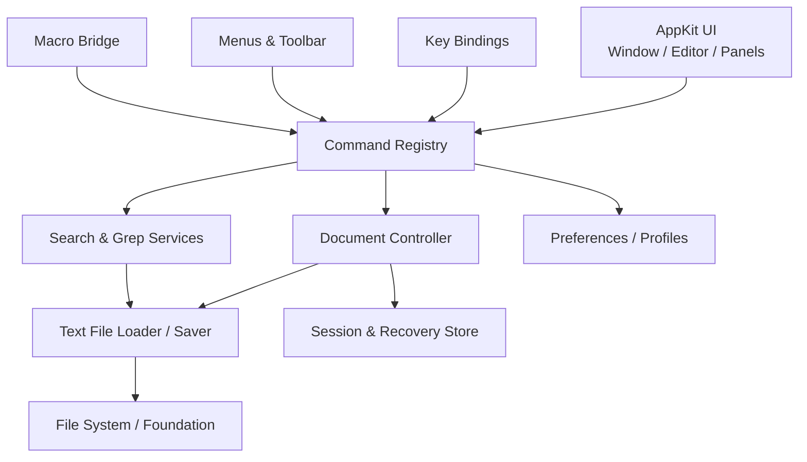
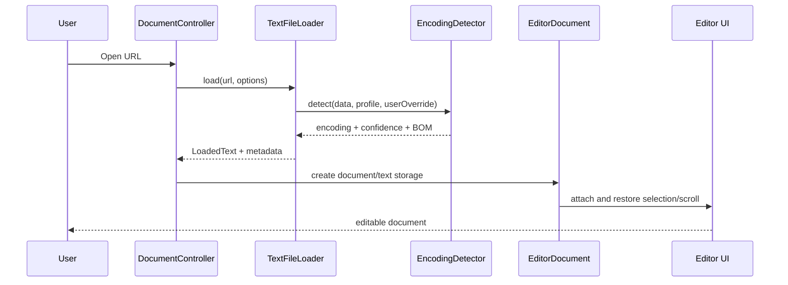
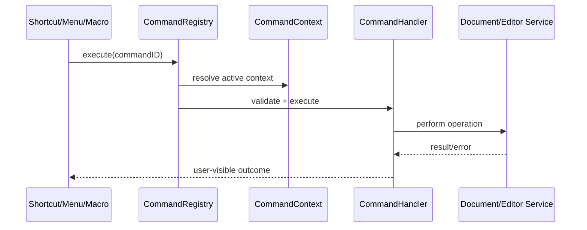

# MaruEdit Engineering Roadmap

> **A tiny, native, keyboard-first text editor for macOS.**  
> Build an independent, open-source macOS text editor on LiteEdit's lightweight foundation, preserving the speed and high-efficiency workflows associated with Hidemaru Editor without copying its code, assets, branding, or visual identity.

---

## Document Status

| Field | Value |
|---|---|
| Product name | **MaruEdit** (provisional; complete trademark and naming-conflict searches before public release) |
| Purpose | Product definition, technical architecture, implementation sequence, acceptance criteria, and execution rules for Claude Code |
| Upstream project | [arietan/lite-edit](https://github.com/arietan/lite-edit) |
| Upstream license | MIT License; the original copyright notice and license text must remain in the fork |
| Recommended MaruEdit license | MIT License |
| Initial platform | macOS 13 Ventura and later |
| Initial architectures | Apple Silicon `arm64` + Intel `x86_64` Universal Binary |
| Primary language | Swift |
| UI framework | AppKit |
| Text system | TextKit 1 / `NSTextView` through 1.0, isolated behind an adapter boundary |
| Initial distribution | GitHub Releases with a signed and notarized DMG |
| Roadmap version | 1.0 |
| Baseline date | 2026-08-04 |

---

# 0. Mandatory Execution Rules for Claude Code

This document is the **engineering source of truth** until MaruEdit 1.0. Claude Code must read it in full before modifying the repository and must follow these rules.

1. **Implement work in Milestone and Task ID order.** Do not skip prerequisites unless a task explicitly states that it can run in parallel.
2. **Work in small batches.** A batch should normally contain one to three adjacent Task IDs so that changes remain reviewable and reversible.
3. **Do not perform a big-bang rewrite.** Start from the working LiteEdit codebase and extract, replace, and validate behavior incrementally.
4. **Keep the repository buildable at the end of every batch.** At minimum, run:

   ```bash
   swift build
   swift test
   bash build.sh
   ```

   If the actual commands change, update `CONTRIBUTING.md` in the same batch and explain the change in the execution report.
5. **Never fabricate test results.** Commands that were not run must be reported as “not run,” never as “passed.”
6. **Do not add third-party runtime dependencies without an approved ADR.** Prefer Apple and official Swift tooling for tests as well.
7. **Do not silently change foundational decisions**, including minimum macOS version, license, bundle identifier, module boundaries, AppKit/TextKit strategy, or distribution model.
8. **When requirements are ambiguous, choose the smallest, safest, most reversible interpretation and record an ADR.** Do not expand scope on your own.
9. **Every commit must add tests or explain why the behavior cannot yet be tested.** For bug fixes, add a reproduction test first whenever practical.
10. **Check only work that is demonstrably complete.** “Mostly working” is not sufficient to mark an entire task or milestone complete.
11. **Do not copy Hidemaru source code, decompiled behavior, icons, screenshots, help text, default themes, error strings, or other protected resources.**
12. **Do not copy CotEditor image assets.** If Apache-2.0 source code is intentionally reused, record the source, copyright, license, and modifications. The default policy remains: understand the design, then implement independently.
13. **Use English for code, type names, comments, commit messages, ADRs, and engineering documentation.** User-facing UI and user documentation must support English, Japanese, and Simplified Chinese from an early stage.
14. **Performance claims require measurements.** Do not claim that MaruEdit is faster, low-memory, or suitable for large files without reproducible data.
15. **After each batch, produce this exact report structure:**

   ```text
   Completed task IDs:
   Files changed:
   User-visible behavior:
   Tests/commands executed:
   Results:
   Architectural decisions:
   Known risks or follow-up:
   Next eligible task ID:
   ```

---

# 1. Product Mission

## 1.1 Why MaruEdit Exists

The macOS editor market is crowded at both extremes:

- very small editors with limited text-processing capability; and
- powerful IDEs or Electron-based editors with large footprints, slower startup, and workspace-oriented complexity.

MaruEdit targets the space between them:

> **Open text immediately, search aggressively, preserve text formats accurately, and work efficiently from the keyboard—while remaining native, small, transparent, and open source.**

“Mac version of Hidemaru” is an internal product shorthand, not public branding. MaruEdit must not reproduce Hidemaru pixel for pixel. It should extract the workflows that make Hidemaru valuable:

- immediate startup and frictionless file opening;
- first-class Find, Replace, Regex, and Grep;
- reliable Japanese encodings, line endings, and plain-text behavior;
- stable commands accessible from keyboard, menus, macros, and future extensions;
- per-file-type customization;
- automation without turning the application into a heavyweight IDE.

## 1.2 Product Commitments

MaruEdit makes six commitments to users:

1. **Fast** — startup, opening, searching, and saving must be fast and measurable.
2. **Native** — windows, menus, keyboard handling, services, drag and drop, accessibility, and text input must behave like a well-built macOS application.
3. **Text-correct** — the editor must not silently corrupt encoding, BOM, line endings, Unicode, or file permissions.
4. **Keyboard-first** — every important operation must have a stable Command ID usable by menus, key bindings, macros, and future extensions.
5. **Automatable** — macros and external commands are core product capabilities, not late-stage add-ons.
6. **Small and understandable** — a small engineering team should be able to understand, maintain, benchmark, and audit the codebase.

## 1.3 Target Users

### Primary users

- Japanese developers and office users moving from Windows/Hidemaru to macOS;
- engineers who frequently edit logs, configuration files, CSV/TSV, scripts, and server-side text;
- users who require Shift-JIS, Windows-31J, EUC-JP, ISO-2022-JP, and other legacy encodings;
- high-frequency text workers who depend on Grep, regex replacement, column editing, custom key bindings, and macros;
- users who prefer open source, no account, no telemetry, and long-term local ownership.

### Secondary users

- English- and Chinese-language users seeking a lightweight native editor;
- translators, publishers, web operators, data-cleaning users, researchers, and educators;
- users who need more than TextEdit but do not want a full IDE.

## 1.4 One-Sentence Definition of 1.0

> **MaruEdit 1.0 is a native, open-source, reliable macOS plain-text editor with powerful Find/Grep, Japanese encoding support, column editing, configurable key bindings, macros, and external commands.**

---

# 2. Non-Goals for 1.0

To keep the product small and focused, MaruEdit 1.0 will not:

- create a pixel-for-pixel clone of Hidemaru's UI;
- use names such as “Official Hidemaru for Mac” or “Hidemaru macOS Edition” that could imply endorsement or affiliation;
- copy Hidemaru icons, menu artwork, help text, error strings, themes, screenshots, or bundled resources;
- implement binary compatibility with Hidemaru DLL plug-ins;
- promise 100% compatibility with all Hidemaru macros;
- become a full IDE with built-in compiler, debugger, hosted Git platform, container management, or large project system;
- use Electron, Chromium, or Node.js as the core runtime;
- add accounts, cloud sync, telemetry, advertising, or analytics;
- bind AI into the core editor; AI belongs in optional post-1.0 extensions;
- simultaneously build iPhone or iPad versions;
- migrate to TextKit 2 merely because it is newer; any migration must be justified by benchmarks and prototypes;
- optimize the first release for App Store sandbox restrictions at the expense of Grep, macros, external commands, or arbitrary user-authorized file access.

---

# 3. Intellectual Property and Brand Boundaries

## 3.1 MaruEdit Is an Independent Implementation

MaruEdit may implement common editor concepts such as Find, Replace, Grep, tabs, macros, rectangular selection, and encoding conversion. Those capabilities must be implemented independently.

Permitted:

- reading publicly available manuals to understand user workflows;
- observing public behavior through normal use;
- implementing standard editor functionality and keyboard workflows;
- objectively documenting compatibility with public macro commands or workflows;
- studying open-source architecture and source code under a clear license.

Prohibited:

- decompiling or copying closed-source implementation details;
- copying icons, bitmaps, themes, help text, or substantial UI wording;
- producing visual branding likely to make users believe MaruEdit comes from Hidemaru's original developer;
- using confusingly similar logos, application icons, or marketing language;
- reusing open-source code without preserving its license and copyright notices.

## 3.2 LiteEdit License Requirements

LiteEdit is licensed under the MIT License. A MaruEdit fork must:

- preserve the original LiteEdit copyright notice;
- keep the complete MIT License in the repository root;
- add `NOTICE.md` or `UPSTREAM.md` explaining that MaruEdit is based on LiteEdit;
- license new MaruEdit code under MIT unless a later approved decision states otherwise;
- preserve original authorship in Git history.

## 3.3 How CotEditor May Be Used

CotEditor is a technical and behavioral reference for a mature native macOS editor:

- study its public architecture, tests, encoding strategy, and Cocoa usage;
- default to independent reimplementation after understanding the approach;
- when Apache-2.0 source is intentionally ported, identify the source and license in the code and `NOTICE.md`;
- do not reuse separately licensed artwork;
- do not turn MaruEdit into a permanently divergent CotEditor fork.

## 3.4 Naming Release Gate

Before any public release under the name “MaruEdit,” complete:

- basic trademark searches in Japan, the United States, the European Union, and intended launch markets;
- conflict searches across GitHub, Mac software directories, app listings, package registries, and domains;
- similarity review of the word mark and app icon;
- an independence statement in the README:

  > MaruEdit is an independent open-source project and is not affiliated with or endorsed by the developers of Hidemaru Editor.

This section is engineering risk control, not a substitute for professional legal advice.

---

# 4. Product Analysis of Hidemaru Editor

This section analyzes Hidemaru's publicly visible user value and workflow, not its internal implementation.

## 4.1 Hidemaru's “Soul” Is Not Its Windows Appearance

Hidemaru's lasting value comes from the combination of:

1. immediate startup and direct text manipulation;
2. highly accessible Find, Replace, Grep, and result navigation;
3. reliable handling of Japanese legacy encodings and line-ending formats;
4. extensive keyboard, menu, mouse, and macro customization;
5. efficient BOX/rectangular selection, multiple selections, and batch editing;
6. file-type settings, syntax presentation, outlines, and tag navigation;
7. external tools, output panes, and macros that turn the editor into a lightweight automation hub;
8. explicit strategies for performance and very large files.

MaruEdit therefore prioritizes:

> **Text correctness → Search/Grep → Command and keyboard systems → Column/multiple selection → Macros → Visual resemblance.**

## 4.2 Capability Value and MaruEdit Priority

| Hidemaru capability area | User value | MaruEdit 1.0 strategy | Priority |
|---|---|---|---:|
| Fast startup and lightweight runtime | Open logs or config files without loading a workspace | Native AppKit, minimal dependencies, performance budgets | P0 |
| Find/Replace/Regex | Core text productivity | One search engine with identical Find and Replace semantics | P0 |
| Folder Grep | Locate text across large file trees | Background, cancellable, streaming results, direct navigation | P0 |
| Encoding detection | Open historical Japanese files correctly | BOM + strict UTF-8 + configurable candidates + round-trip validation | P0 |
| Encoding and line-ending control | Explicit control over saved bytes | Clickable status controls and representability checks before save | P0 |
| BOX/rectangular selection | Edit aligned text and tables efficiently | Visual-column model that handles tabs and full-width characters | P0 |
| Multiple selections | Edit repeated locations simultaneously | `selectedRanges`, grouped Undo, correct IME behavior | P0 |
| Key assignment | Preserve user muscle memory | Command Registry + JSON keymap + chorded shortcuts | P0 |
| Macros | Automate repetitive text work | JavaScriptCore with a safe, versioned `maru.*` API | P0/P1 |
| File-type settings | Different behavior for different files | FileType Profiles matched by filename and extension | P1 |
| Menu customization | Surface frequent commands | Registry-built menus with basic customization in 1.0 | P1 |
| Invisible characters | Detect whitespace and line-ending problems | TextKit drawing layer without mutating document text | P1 |
| Bookmarks | Navigate long files quickly | Per-document bookmarks and next/previous commands | P1 |
| Output window | Host Grep, tool, and diagnostic results | Shared structured Output Pane | P1 |
| External programs | Connect the editor to scripts and toolchains | Safe Process runner for document or selection input | P1 |
| Outline/folding | Navigate structured source | Post-1.0 | P2 |
| Tag jump/compare | Lightweight code navigation and text comparison | Post-1.0 | P2 |
| Full Hidemaru macro compatibility | Preserve migration assets | Experimental subset with a command-by-command matrix | P2 |
| DLL plug-in compatibility | Windows ecosystem extension | Not supported | Non-goal |

## 4.3 Default Interface Direction

MaruEdit should feel natural to users of efficient classic editors while remaining visibly and behaviorally native to macOS.

Recommended default layout:

```text
┌──────────────────────────────────────────────────────────────┐
│ macOS title bar / optional compact toolbar                  │
├──────────────────────────────────────────────────────────────┤
│ Tab bar (shown by default only when multiple documents open)│
├───────────────┬──────────────────────────────────────────────┤
│ Optional      │ Editor                                      │
│ file sidebar  │ NSTextView + line numbers + gutter           │
│ (hidden by    │                                             │
│ default)      │                                             │
├───────────────┴──────────────────────────────────────────────┤
│ Find bar or Output Pane (shown on demand)                   │
├──────────────────────────────────────────────────────────────┤
│ Ln / Col / Sel | Encoding | Line Ending | Language | Mode   │
└──────────────────────────────────────────────────────────────┘
```

Recommended menus:

```text
MaruEdit | File | Edit | Search | View | Tools | Macro | Window | Help
```

Constraints:

- keep the toolbar minimal or hidden by default;
- hide the sidebar by default so the product does not feel like an IDE;
- always expose encoding and line-ending state clearly;
- treat Find, Grep, and output as primary surfaces, not buried utilities;
- ensure every control is keyboard accessible;
- use native `NSPanel`, `NSMenu`, `NSToolbar`, standard pickers, and macOS accessibility APIs rather than reproducing Windows dialogs.

---

# 5. Assessment of the LiteEdit Starting Point

## 5.1 Why LiteEdit Is the Right Base

LiteEdit aligns closely with MaruEdit's product direction:

- native Swift + AppKit;
- built on TextKit / `NSTextView`;
- focused on a single lightweight desktop application;
- no third-party dependencies;
- already includes tabs, a sidebar, line numbers, a status bar, a find bar, syntax highlighting, session restoration, and a basic multi-cursor prototype;
- small enough for a small team to understand and control.

LiteEdit should be treated as the **working skeleton**, not the final architecture.

## 5.2 Components Worth Preserving Initially

Protect these behaviors with characterization tests before changing them:

- application launch and main-window creation;
- `NSTextView`, scroll view, and line-number layout;
- basic tab and document switching;
- file sidebar and Quick Open UI;
- visual structure of the Find Bar and status bar;
- minimal theme and syntax-highlighting implementation;
- initial session restoration data;
- basic shortcuts and multi-selection prototype.

## 5.3 Technical Debt That Must Be Addressed

### Documents and file I/O

- the current `Document` path primarily assumes UTF-8;
- encoding, BOM, line endings, and permissions are not first-class metadata;
- atomic saving, external-modification detection, and conflict handling are incomplete;
- unnamed unsaved documents lack a robust crash-recovery model.

### Controllers own too much

- `MainWindowController` coordinates windows, documents, tabs, sidebar, saving, sessions, and search;
- `EditorViewController` coordinates TextKit, themes, syntax, Find, Replace, and text events;
- adding Grep, macros, file profiles, and multiple windows without refactoring will create God Objects.

### Search and replacement semantics are fragmented

- literal and regex behavior must be consistent across Find, Replace, and Replace All;
- capture groups, zero-length matches, case sensitivity, whole-word matching, wrapping, selection scope, and multiline behavior need one definition;
- Find history and Grep must not invent separate search semantics.

### Multi-cursor behavior is fragile

- global state and local event monitors risk cross-window interference;
- multiple edits, syntax repainting, and Undo require a defined ordering model;
- Japanese and Chinese marked text cannot be broadcast as ordinary key events;
- selection logic must be rebuilt around `NSTextView.selectedRanges` and one `SelectionSet` per editor instance.

### Performance risks

- line-number calculations that rescan from the beginning degrade on large files;
- regex syntax highlighting on the main thread may block typing and scrolling;
- complete copies across `String`, `Data`, and `NSTextStorage` may inflate memory;
- there are no reproducible startup, opening, search, or memory benchmarks.

### Missing engineering safeguards

- no systematic test targets or encoding fixtures;
- no ADR discipline, versioned session schema, or migration system;
- strings, key bindings, and settings remain coupled to code;
- no complete CI, release, signing, or notarization process.

## 5.4 Refactoring Principles

- do not throw away the working application;
- first extract boundaries while preserving existing behavior;
- make file I/O, search, commands, and settings independently testable;
- keep UI controllers focused on view lifecycle and user interaction;
- expose every capability through the Command Registry;
- assign every mutable state object explicitly to App, Window, Document, or Editor scope.

---

# 6. Technical Direction and Architecture Decisions

## ADR-001: Use Swift + AppKit

**Decision:** MaruEdit 1.0 uses Swift, Foundation, and AppKit.  
**Reason:** The product needs mature desktop behavior from `NSWindow`, `NSMenu`, `NSTextView`, `NSTableView`, `NSOutlineView`, system services, and keyboard command APIs.  
**SwiftUI policy:** SwiftUI is not the primary UI framework before 1.0. It may later be evaluated for isolated settings screens only if it does not introduce a second state model.

## ADR-002: Keep TextKit 1 Through 1.0

**Decision:** Retain LiteEdit's TextKit 1 / `NSTextView` path while isolating critical calls behind an `EditorTextSystem` protocol.  
**Reason:** The current base works, and column selection, layout, syntax, and multiple selection need stable behavior. An immediate TextKit 2 migration would turn product development into a framework-migration project.  
**Exit condition:** M7 must demonstrate a clear correctness, performance, and maintenance benefit through a separate spike and benchmarks before a new ADR may approve migration.

## ADR-003: Zero Third-Party Runtime Dependencies by Default

**Decision:** MaruEdit 1.0 should use only Apple SDKs and the Swift standard library at runtime.  
**Exceptions:** Require an ADR covering binary size, license, maintenance cadence, security surface, alternatives, and an exit strategy.  
**Goal:** Small binaries, fast startup, long-term maintainability, and a transparent supply chain.

## ADR-004: Swift Package Manager Is the Build Source of Truth

Maintain at least:

- `MaruEditCore` — primarily Foundation-based and unit-testable;
- `MaruEditApp` — AppKit UI and application executable.

Test targets:

- `MaruEditCoreTests`;
- `MaruEditAppTests` for AppKit-dependent integration behavior;
- a UI test runner may be added later, but no complex project generator is required initially.

## ADR-005: Refactor the Existing Document Model Before Adopting NSDocument

**Decision:** Keep LiteEdit's custom tab/document model through 1.0, while introducing explicit `DocumentController`, `EditorDocument`, and `TextFileService` boundaries.  
**Reason:** Migrating immediately to Cocoa Document Architecture would simultaneously change window, tab, restoration, and save semantics.  
**Requirement:** The custom model must still implement the save, restore, external-conflict, and close-confirmation behavior macOS users expect. Re-evaluate `NSDocument` in M7.

## ADR-006: The Command Registry Is the Only Feature Entry Point

Menus, key bindings, toolbar items, command palette, macros, and future extensions must call stable Command IDs rather than directly manipulating controllers.

Examples:

```text
file.new
file.open
file.save
file.reopenWithEncoding
edit.deleteLine
edit.selectColumn
search.find
search.replaceAll
search.grep
view.toggleInvisibles
macro.run
tools.runExternalCommand
```

## ADR-007: Direct Distribution First, App Store Later

The initial release will use Developer ID signing, notarization, and DMG distribution because:

- Grep needs sustained access to user-selected folders;
- external commands need `Process`;
- macros may need user-authorized paths and the current file;
- sandboxing would create substantial bookmark, permission, and feature divergence.

A separate App Store variant may be evaluated after 1.0, but it must not weaken the primary build.

## ADR-008: No Telemetry, Accounts, or Implicit Networking

- send no usage data by default;
- expose no network API to macros;
- any future update checker must be explicit, documented, and disable-able;
- keep the privacy statement short and auditable.

---

# 7. Target Repository Structure

Keep module count disciplined. The recommended 1.0 structure is:

```text
MaruEdit/
├── Package.swift
├── build.sh
├── LICENSE
├── NOTICE.md
├── UPSTREAM.md
├── README.md
├── ROADMAP.md
├── CHANGELOG.md
├── CONTRIBUTING.md
├── SECURITY.md
├── docs/
│   ├── adr/
│   │   ├── 0001-appkit-and-textkit1.md
│   │   ├── 0002-command-registry.md
│   │   └── ...
│   ├── architecture.md
│   ├── commands.md
│   ├── compatibility/
│   │   ├── hidemaru-workflow-matrix.md
│   │   └── macro-compatibility.md
│   ├── performance.md
│   └── release-checklist.md
├── Sources/
│   ├── MaruEditCore/
│   │   ├── Commands/
│   │   │   ├── CommandID.swift
│   │   │   ├── CommandDefinition.swift
│   │   │   ├── CommandRegistry.swift
│   │   │   └── CommandContext.swift
│   │   ├── Documents/
│   │   │   ├── DocumentMetadata.swift
│   │   │   ├── DocumentSnapshot.swift
│   │   │   ├── FileIdentity.swift
│   │   │   └── LineEnding.swift
│   │   ├── TextIO/
│   │   │   ├── TextEncoding.swift
│   │   │   ├── EncodingDetector.swift
│   │   │   ├── TextFileLoader.swift
│   │   │   ├── TextFileSaver.swift
│   │   │   └── SavePreflight.swift
│   │   ├── Search/
│   │   │   ├── SearchQuery.swift
│   │   │   ├── SearchEngine.swift
│   │   │   ├── ReplacementTemplate.swift
│   │   │   └── SearchHistory.swift
│   │   ├── Grep/
│   │   │   ├── GrepRequest.swift
│   │   │   ├── GrepService.swift
│   │   │   ├── GrepResult.swift
│   │   │   └── FileFilter.swift
│   │   ├── Settings/
│   │   │   ├── PreferencesStore.swift
│   │   │   ├── FileTypeProfile.swift
│   │   │   ├── KeyBinding.swift
│   │   │   └── SettingsMigration.swift
│   │   ├── Sessions/
│   │   │   ├── SessionState.swift
│   │   │   ├── SessionStore.swift
│   │   │   └── RecoveryStore.swift
│   │   └── Utilities/
│   │       ├── AtomicFileWriter.swift
│   │       ├── Debouncer.swift
│   │       └── Logger.swift
│   └── MaruEditApp/
│       ├── Application/
│       │   ├── AppDelegate.swift
│       │   ├── AppCoordinator.swift
│       │   └── AppEnvironment.swift
│       ├── Documents/
│       │   ├── EditorDocument.swift
│       │   ├── DocumentController.swift
│       │   └── DocumentWindowCoordinator.swift
│       ├── Editor/
│       │   ├── EditorViewController.swift
│       │   ├── EditorTextSystem.swift
│       │   ├── SelectionSet.swift
│       │   ├── LineIndex.swift
│       │   ├── LineNumberView.swift
│       │   ├── InvisibleCharacterRenderer.swift
│       │   └── SyntaxHighlightCoordinator.swift
│       ├── Windows/
│       │   ├── MainWindowController.swift
│       │   ├── TabBarView.swift
│       │   ├── SidebarViewController.swift
│       │   ├── StatusBarView.swift
│       │   └── OutputPaneController.swift
│       ├── SearchUI/
│       │   ├── FindBarView.swift
│       │   ├── GrepPanelController.swift
│       │   └── GrepResultsController.swift
│       ├── Commands/
│       │   ├── AppCommands.swift
│       │   ├── EditorCommands.swift
│       │   ├── SearchCommands.swift
│       │   └── MenuBuilder.swift
│       ├── KeyBindings/
│       │   ├── KeyBindingManager.swift
│       │   ├── KeyEventTranslator.swift
│       │   └── ChordStateMachine.swift
│       ├── Macros/
│       │   ├── MacroEngine.swift
│       │   ├── MacroBridge.swift
│       │   ├── MacroManagerController.swift
│       │   └── MacroPermissionStore.swift
│       ├── Tools/
│       │   ├── ExternalCommand.swift
│       │   └── ProcessRunner.swift
│       └── Resources/
│           ├── Base.lproj/
│           ├── en.lproj/
│           ├── ja.lproj/
│           ├── zh-Hans.lproj/
│           ├── Themes/
│           └── Syntaxes/
├── Tests/
│   ├── MaruEditCoreTests/
│   ├── MaruEditAppTests/
│   └── Fixtures/
│       ├── Encodings/
│       ├── LineEndings/
│       ├── Search/
│       ├── GrepTrees/
│       └── Sessions/
└── scripts/
    ├── build-release.sh
    ├── benchmark-launch.sh
    ├── benchmark-open-file.sh
    ├── make-dmg.sh
    └── verify-licenses.sh
```

> This is a target structure, not an instruction to create every empty file in M0. Create files only when the corresponding milestone requires real implementation.

---

# 8. Runtime Architecture

## 8.1 Layering



Rules:

- UI code must not assemble file decoding, regular expressions, Grep traversal, or save protocols directly;
- macros must not hold `NSTextView` references;
- commands resolve the active window, document, and editor through `CommandContext`;
- Core services should avoid AppKit whenever possible;
- expensive I/O and Grep work run off the main thread; UI updates return to `MainActor`.

## 8.2 Document-Open Flow



Opening must:

- be cancellable where practical and must never freeze the UI;
- ask the user when encoding cannot be identified reliably instead of silently inserting replacement characters;
- finish basic format detection before constructing the editable view;
- record file identity, modification date, permissions, encoding, BOM, and line-ending state.

## 8.3 Command Invocation Flow



The same feature must not develop three different behaviors in menus, key bindings, and macros.

---

# 9. Core Data Models

The following declarations define direction, not byte-for-byte requirements. Material deviations require an ADR.

## 9.1 Document Metadata

```swift
public struct DocumentMetadata: Sendable, Equatable {
    public var url: URL?
    public var displayName: String
    public var encoding: TextEncoding
    public var hasByteOrderMark: Bool
    public var lineEnding: LineEndingState
    public var isReadOnly: Bool
    public var fileIdentity: FileIdentity?
    public var lastKnownModificationDate: Date?
    public var lastKnownFileSize: Int64?
}

public enum LineEndingState: Sendable, Equatable {
    case lf
    case crlf
    case cr
    case mixed(summary: LineEndingSummary)
    case none
}
```

## 9.2 EditorDocument

`EditorDocument` is an `@MainActor` reference type responsible for the runtime state of one open document:

- its `NSTextStorage`;
- `DocumentMetadata`;
- text revision and dirty state;
- selections, scroll position, wrapping, and view state;
- active FileType Profile;
- Recovery ID;
- external-file conflict state.

It is not responsible for:

- traversing directories for Grep;
- presenting alerts;
- parsing key events;
- executing JavaScript;
- manually assembling session JSON.

## 9.3 TextEncoding

Do not serialize encodings as raw `String.Encoding` integers. Define a stable, serializable, displayable type:

```swift
public struct TextEncoding: RawRepresentable, Codable, Sendable, Hashable {
    public let rawValue: String   // stable IANA-like identifier
}
```

Initial candidates:

- UTF-8 with and without BOM;
- UTF-16 LE/BE;
- UTF-32 LE/BE;
- Shift-JIS;
- Windows-31J / CP932;
- EUC-JP;
- ISO-2022-JP;
- ASCII;
- other common encodings reliably supported by macOS.

The UI must distinguish Shift-JIS from Windows-31J rather than showing only a vague “Japanese” label.

## 9.4 Search Model

```swift
public struct SearchQuery: Sendable, Equatable {
    public var pattern: String
    public var replacement: String?
    public var mode: SearchMode
    public var isCaseSensitive: Bool
    public var wholeWord: Bool
    public var wraps: Bool
    public var scope: SearchScope
}

public enum SearchMode: Sendable {
    case literal
    case regularExpression
}
```

Find, Replace, Replace All, Select All Matches, and Grep must share option semantics.

## 9.5 Command Registry

```swift
public struct CommandID: RawRepresentable, Hashable, Codable, Sendable {
    public let rawValue: String
}

public struct CommandDefinition {
    public let id: CommandID
    public let titleKey: String
    public let category: CommandCategory
    public let defaultKeyBindings: [KeyBinding]
    public let isEnabled: @MainActor (CommandContext) -> Bool
    public let execute: @MainActor (CommandContext) async throws -> Void
}
```

Requirements:

- published Command IDs remain stable;
- user keymaps, macros, and menu configurations refer only to Command IDs;
- localized titles are never internal identifiers;
- menu validation and `validateUserInterfaceItem` read from the same `isEnabled` source.

---

# 10. Text-Correctness Strategy

## 10.1 Encoding Detection Order

Recommended pipeline:

1. inspect BOM;
2. honor an explicit “Reopen with Encoding” override;
3. inspect the matching FileType Profile's configured encoding;
4. inspect declared charsets in formats such as XML, HTML, or CSS as a signal, then validate;
5. strictly validate UTF-8;
6. evaluate Windows-31J, Shift-JIS, EUC-JP, ISO-2022-JP, and other user-configurable candidates;
7. perform decode → encode round-trip checks and score replacement characters, controls, and invalid sequences;
8. when confidence remains low, show an encoding picker with preview—never silently choose lossy conversion.

Detection should return:

```swift
struct EncodingDetectionResult {
    let encoding: TextEncoding
    let confidence: DetectionConfidence
    let hadBOM: Bool
    let diagnostics: [EncodingDiagnostic]
}
```

## 10.2 Save Preflight

Every save must verify:

- whether the current string is losslessly representable in the target encoding;
- which characters, if any, cannot be represented;
- whether the file changed externally;
- whether the destination directory is writable;
- whether permissions or extended attributes should be preserved;
- whether mixed line endings require a user decision;
- whether the target URL changed.

For unrepresentable characters, offer at least:

- Cancel;
- Save as UTF-8;
- Show unrepresentable characters with line and column;
- an explicit lossy-save option only as a clearly marked advanced action, not the default.

## 10.3 Line-Ending Policy

The internal editing buffer uses `\n`, while metadata preserves source state.

1. Preserve uniform LF, CRLF, or CR by default.
2. Do not add a trailing newline to a one-line file unless configured.
3. Show `Mixed` in the status bar for mixed files.
4. If a mixed file is edited and saved, require the user to choose a target line ending in 1.0.
5. “Add newline at end of file on save” is explicit and off by default.
6. Exact per-line separator preservation may be investigated after 1.0.

## 10.4 Japanese Text Fixture Set

Encoding fixtures must include at least:

```text
日本語、漢字、ひらがな、カタカナ、半角ｶﾅ
① ㈱ 髙 﨑 ～ 〜 ¥ \ — −
Emoji: 😀 🗻
Combining characters: é / が
```

The purpose is not to force every character into every legacy encoding. Tests must prove that:

- representable text round-trips accurately;
- unrepresentable text is detected;
- wave-dash and yen/backslash legacy differences are not silently altered;
- users see a clear result when changing encodings.

## 10.5 Safe-Save Protocol

1. Create a temporary file on the same file system.
2. Write the complete target bytes and synchronize as needed.
3. Replace the original atomically.
4. Preserve permissions and relevant attributes where practical.
5. Update file identity and modification metadata only after success.
6. On failure, keep the original intact and never report the temporary write as success.
7. On external-modification conflict, offer Reload, Save As, Compare Later, and Cancel as appropriate.

Prefer Foundation coordination and replacement APIs over a custom unsafe file protocol.

---

# 11. Search, Replace, and Grep Architecture

## 11.1 Unified Search Semantics

One `SearchEngine` must support:

- literal and regex modes;
- case sensitivity;
- whole-word matching;
- selection and document scopes;
- wrap-around;
- next and previous;
- replace current and replace all;
- select all matches;
- capture-group replacement;
- safe progress after zero-length matches;
- Unicode and multiline text.

Find and Replace All must not use different algorithms that produce inconsistent result sets.

## 11.2 Regex Conventions

1. Use `NSRegularExpression` for 1.0.
2. Document that syntax follows ICU/Apple regex behavior.
3. Support `$1`-style capture groups with documented escaping rules.
4. Show invalid-pattern errors immediately without clearing user input.
5. Guarantee progress after zero-length matches.
6. Large-text matching may run off the main thread, but selection changes return to the main actor.
7. Persist pattern, replacement, and option history separately and make it clearable.

## 11.3 Grep Service

Implement `GrepService` as an actor where appropriate, exposing `AsyncThrowingStream<GrepEvent>`:

```swift
public enum GrepEvent: Sendable {
    case started(totalEstimate: Int?)
    case match(GrepMatch)
    case skippedFile(URL, reason: SkipReason)
    case progress(scannedFiles: Int)
    case finished(GrepSummary)
}
```

Required capabilities:

- recursive traversal;
- include/exclude globs;
- optional hidden files;
- symbolic links disabled by default;
- optional package traversal;
- maximum file size;
- binary-file skipping;
- encoding detection;
- cancellation;
- streaming results;
- path, line, column, and preview text;
- double-click or Return to open and locate;
- query history;
- copy, save, and rerun results.

Grep results should use a structured Output Pane rather than pretending to be an ordinary editable document.

## 11.4 Grep Replace

Bulk replacement is high risk and belongs in M6:

- scan and build a preview first;
- display every file and replacement;
- allow deselecting files or individual matches;
- revalidate external modification before writing;
- write atomically;
- create recoverable backups or a transaction log by default;
- make partial completion explicit when cancellation or failure occurs;
- never ship an initial “replace everything without preview” workflow.

---

# 12. Multiple Selection, BOX Selection, and IME

## 12.1 SelectionSet

Each `EditorViewController` owns its own `SelectionSet`; no global mutable selection maps are permitted.

```swift
@MainActor
final class SelectionSet {
    private(set) var ranges: [NSRange]
    var primaryIndex: Int
}
```

Rules:

- sort, deduplicate, and merge overlapping ranges;
- maintain an explicit primary selection;
- apply edits from the end toward the beginning to avoid offset drift;
- group one multi-selection edit into one Undo operation;
- syntax highlighting must not clear selections;
- remove event monitors and observers when an editor closes.

## 12.2 BOX / Rectangular Selection

Rectangular selection must be based on **visual columns**, not only UTF-16 offsets. Account for:

- tab width;
- full-width characters;
- combining characters;
- proportional versus monospaced fonts;
- wrapping;
- empty lines and virtual space beyond end-of-line.

Use a monospaced default font. The first correct implementation may prioritize no-wrap mode; wrap behavior must be explicitly documented and tested.

Interaction:

- Option-drag creates a rectangular selection;
- menu and command palette expose “Begin Column Selection”;
- copy, delete, insert, and multiline paste work across selected rows;
- a documented rule governs paste line-count mismatches.

## 12.3 CJK IME Behavior

IME correctness is P0:

- marked text is composed only at the primary selection;
- after composition commits, replicate final text to the other cursors;
- canceling composition with Escape must not alter secondary cursors;
- the candidate window follows the primary cursor;
- one Undo reverts one committed composition;
- manually test Japanese Romaji, Japanese Kana, and Chinese Pinyin input.

Do not broadcast `keyDown` characters to every selected range.

---

# 13. Key Bindings, Menus, and Commands

## 13.1 Built-In Keybinding Profiles

Provide two built-in profiles:

1. **macOS Standard** — conventional Mac shortcuts;
2. **Maru Classic** — an independent profile for users accustomed to efficient Windows-style editors.

Users can select, duplicate, edit, import, export, and reset profiles.

## 13.2 KeyBinding Data Format

Recommended JSON:

```json
{
  "schemaVersion": 1,
  "bindings": [
    { "keys": ["cmd+f"], "command": "search.find" },
    { "keys": ["cmd+shift+f"], "command": "search.grep" },
    { "keys": ["ctrl+k", "ctrl+c"], "command": "edit.commentLine" }
  ]
}
```

Requirements:

- express characters and modifiers portably instead of relying primarily on hardware key codes;
- support two-step chords;
- detect conflicts;
- import and export;
- restore defaults;
- version the schema;
- display active bindings in menus;
- avoid consuming normal text input while an IME is active;
- define and document chord timeout and cancellation behavior.

## 13.3 Menu Construction

Menu items derive from or bind to the `CommandRegistry`:

- titles use localization keys;
- enabled state uses command validation;
- shortcuts come from the active keymap;
- macros register dynamic commands under the Macro menu;
- basic menu customization is P1;
- controllers must not maintain duplicate selectors and validation logic.

---

# 14. Macro System

## 14.1 Design Goals

The purpose of macros is not unrestricted arbitrary code execution. It is to compose stable, shareable, auditable editor commands.

Use Apple's `JavaScriptCore` for 1.0 because it:

- requires no bundled Node.js runtime;
- has a small footprint;
- supports a constrained bridge;
- is well suited to text transformation and command orchestration.

Recommended extension:

```text
*.maru.js
```

Default directory:

```text
~/Library/Application Support/MaruEdit/Macros/
```

## 14.2 Initial API

```javascript
maru.document.text
maru.document.filePath
maru.document.encoding
maru.editor.selectedText()
maru.editor.replaceSelection(text)
maru.editor.selections()
maru.editor.setSelections(ranges)
maru.commands.run("search.find")
maru.search.findAll(pattern, options)
maru.ui.message(text)
maru.ui.prompt(options)
maru.clipboard.readText()
maru.clipboard.writeText(text)
```

Constraints:

- expose `maru.apiVersion`;
- route UI and document changes through a MainActor bridge;
- make long-running macros cancellable;
- log duration and errors;
- report filename, line, and stack for errors;
- never expose raw `NSTextView`, `NSWindow`, or arbitrary Objective-C runtime objects.

## 14.3 Security Boundary

Do not expose by default:

- network access;
- arbitrary file traversal;
- arbitrary shell execution;
- Keychain;
- Contacts, Calendar, or other private system data.

When a macro requests access outside the current document or requests external command execution:

- use a separate capability API;
- prompt on first use;
- display the macro name and requested capability;
- persist the user's choice;
- provide a revocation UI.

Macros must not autorun when a file opens unless a future trusted-workspace mechanism is explicitly designed.

## 14.4 Hidemaru Macro Compatibility Strategy

Do not promise all-at-once compatibility. Use four layers:

1. establish MaruEdit's own stable Command and Macro APIs;
2. identify high-frequency public macro commands from real user needs;
3. build an independent parser/interpreter for public semantics only;
4. maintain a command-by-command compatibility matrix and tests without copying original help wording.

Compatibility states:

```text
Unsupported
Parsed only
Partially compatible
Compatible for documented cases
MaruEdit-specific extension
```

Keep the experimental compatibility layer behind a feature flag so it cannot destabilize the native API.

---

# 15. File Types, Syntax, and Display Settings

## 15.1 FileType Profile

Each profile may define:

- filename, extension, and UTType matching;
- default encoding and detection candidate order;
- default line ending;
- tab width;
- tabs versus spaces;
- wrapping;
- font and theme;
- syntax definition;
- comment delimiters;
- save behavior;
- shortcuts to external commands.

Precedence:

```text
Document override > workspace/folder override (future) > FileType Profile > global defaults
```

## 15.2 Syntax Highlighting

LiteEdit's regex highlighter may remain initially, but refactor it so that:

- definitions are separate from UI;
- updates are debounced;
- only visible ranges and required context are processed;
- revision tokens discard stale results;
- attributes are applied on the main thread;
- highlighting never changes text or selections;
- large-file mode degrades automatically;
- pathological regular expressions have range or time budgets.

Tree-sitter is not a 1.0 prerequisite. A future integration must remain an optional syntax engine and must not leak into Document, Search, or Command models.

## 15.3 Invisible Characters

Support display of:

- spaces;
- tabs;
- LF/CRLF/CR;
- full-width spaces;
- non-breaking spaces;
- optional warnings for zero-width characters.

Render them through layout or drawing layers; never insert marker characters into the document text.

---

# 16. Performance and Large-File Strategy

## 16.1 Performance Budgets

Establish baselines in M0 and validate them in M7. Initial reference hardware is a MacBook Air M2 with 16 GB RAM; always record OS version, build configuration, fixture, and commit SHA.

| Metric | 1.0 target |
|---|---:|
| Release app bundle, excluding signing overhead | ≤ 15 MB |
| Cold launch to editable blank document, median | ≤ 300 ms |
| Idle RSS with one window | ≤ 80 MB |
| Open 1 MB UTF-8 file to editable state | ≤ 200 ms |
| Open 10 MB UTF-8 file to editable state | ≤ 1 s |
| Literal Find Next in 10 MB text | ≤ 100 ms |
| One non-interactive main-thread task | Preferably < 50 ms |
| Grep | UI remains responsive, operation is cancellable, results stream progressively |

These are engineering targets, not marketing promises. When a target is missed, record the actual result, bottleneck, and tradeoff.

## 16.2 File Modes

Thresholds must be tuned from benchmarks rather than treated as permanent product promises.

### Normal Mode

- complete editing;
- syntax highlighting;
- multiple and BOX selection;
- wrapping;
- full Undo;
- intended for ordinary files.

### Reduced Features Mode

- disable syntax highlighting, wrapping, and expensive invisible-character rendering for large files;
- reduce Undo depth;
- show the active mode clearly;
- allow users to re-enable features knowingly.

### Streaming Read-Only Mode (post-1.0 or M7 experiment)

- memory-mapped or chunk-indexed viewing for very large logs;
- retain search and navigation;
- do not promise full editing;
- isolate this mode from ordinary `NSTextStorage` editing.

## 16.3 Known Hotspots to Optimize

- add an incremental `LineIndex` instead of rescanning from the start;
- constrain syntax work by revision and visible range;
- avoid keeping complete `String`, `Data`, and `NSTextStorage` copies indefinitely;
- stream Grep without loading every file and result into memory;
- debounce Session and Recovery writes;
- use Instruments to inspect allocations, main-thread stalls, and leaks;
- unregister every event monitor and observer at lifecycle end.

---

# 17. Accessibility, Localization, and Privacy

## 17.1 Localization

Starting in M1, no new hard-coded user-facing strings are allowed. Initial languages:

- English;
- Japanese;
- Simplified Chinese.

Localize:

- menus;
- Find and Grep;
- settings;
- encoding and line-ending names;
- errors, conflicts, and save warnings;
- Macro Manager;
- core Help and README content.

## 17.2 Accessibility

- VoiceOver can identify the editor, tabs, status bar, Grep results, and controls;
- all operations are keyboard accessible;
- error and selection state are not communicated by color alone;
- support Increase Contrast and Reduce Motion;
- respect system typography and user editor font size;
- custom drawing provides accessibility labels and values.

## 17.3 Privacy

- no telemetry;
- no advertising;
- no sign-in;
- no cloud upload;
- transparent macro and external-command permissions;
- any future crash upload must be opt-in and previewable by the user.

---

# 18. Milestone Overview

| Milestone | Suggested version | Goal |
|---|---:|---|
| M0 | 0.0.1 | Traceable fork, brand, license, reproducible build, and baseline |
| M1 | 0.1.0 | Architecture stabilization, tests, and Command Registry |
| M2 | 0.2.0 | Encodings, line endings, safe save, recovery, and file conflicts |
| M3 | 0.3.0 | Unified Find/Replace and folder Grep |
| M4 | 0.4.0 | BOX, multiple selection, IME, and core editing commands |
| M5 | 0.5.0 | Key bindings, settings, file profiles, display, and themes |
| M6 | 0.6.0 | Macros, external commands, and Grep Replace |
| M7 | 0.9.0 | Performance, large files, reliability, and security hardening |
| M8 | 1.0.0 | Beta convergence, signing, notarization, documentation, and release |

A milestone is not complete until its Gate passes. Do not declare the next version complete before the previous Gate is satisfied.

---

---


# 19. M0 — Fork, Brand, and Reproducible Baseline

**Goal:** Convert LiteEdit into a legally traceable MaruEdit repository without changing core editing behavior.

## M0-01: Record Upstream Provenance

- [ ] Fork LiteEdit or import its complete Git history. *(Not done — this repo's history starts fresh at the branding-sync commit rather than a clone/fork; grafting upstream history would require a destructive rewrite of an already-pushed branch. See "Known Limitation" in `UPSTREAM.md`.)*
- [x] Record the upstream URL, exact base commit SHA, and import date in `UPSTREAM.md`.
- [x] Preserve original author and commit metadata. *(Recorded in `UPSTREAM.md`'s provenance table, not imported into Git history — see above.)*
- [x] Document the `upstream` remote configuration.
- [x] Document how future upstream fixes will be reviewed and selectively integrated.

**Acceptance:** Any maintainer can identify the exact LiteEdit revision from which MaruEdit began.

## M0-02: License and Notice

- [x] Preserve LiteEdit's MIT copyright notice.
- [x] Keep the complete MIT License in the root `LICENSE` file.
- [x] Add `NOTICE.md` describing upstream attribution and MaruEdit modifications.
- [x] Add `scripts/verify-licenses.sh` to verify required license files.
- [x] Add the independent-project and non-affiliation statement to the README.

**Acceptance:** Every release archive contains `LICENSE`, `NOTICE.md`, and upstream provenance.

## M0-03: Safe Renaming

- [x] Rename package, targets, executable, menu title, and visible application name to MaruEdit.
- [x] Use provisional bundle identifier `network.tos.maruedit`; isolate it in one build-configuration location.
- [x] Move Application Support, preferences, and session paths into a MaruEdit namespace. *(The app only reads/writes `UserDefaults.standard`, which macOS already namespaces per bundle identifier — no hardcoded LiteEdit paths existed to move.)*
- [x] Do not reuse LiteEdit or Hidemaru icons; use an original placeholder icon until branding is finalized.
- [x] Remove user-visible LiteEdit naming except required attribution.
- [x] Do not treat old LiteEdit sessions as MaruEdit configuration without an explicit migration. *(N/A — no shipped LiteEdit-named build of this fork exists to migrate from; the bundle identifier changed before any release.)*

**Acceptance:** The application, menus, About panel, process, bundle, and support paths consistently identify MaruEdit.

## M0-04: Build Baseline

- [x] Keep the minimum deployment target at macOS 13+.
- [x] Keep `swift-tools-version: 5.9`; do not change Swift language mode in M0.
- [x] Ensure `swift build` succeeds.
- [x] Ensure `bash build.sh` creates a launchable `.app`.
- [x] Make Debug and Release paths explicit. *(Documented in README.md's new "Debug vs. Release builds" subsection.)*
- [x] Document the Universal Binary build procedure. *(`scripts/build-release.sh`, documented in README.md; verified it actually produces an `arm64`+`x86_64` fat binary via `lipo -info` and that the resulting bundle launches.)*
- [x] Reduce compiler warnings to zero or maintain a documented temporary allowlist. *(Zero warnings on a clean `rm -rf .build && swift build -c release`.)*

**Acceptance:** A clean checkout builds and launches using the README instructions.

## M0-05: Test and CI Skeleton

- [x] Add a `MaruEditTests` target for the current module arrangement. *(At the time: single `executableTarget` tested via `@testable import MaruEdit`, per Swift 5.5+ executable-target testing support. Superseded by M1-01, which split this into `MaruEditCoreTests` + `MaruEditAppTests` alongside the `MaruEditCore`/`MaruEditApp` target split.)*
- [x] Add at least one smoke test. *(At the time: `Tests/MaruEditTests/DocumentTests.swift` — 4 tests. After M1-01: split across `Tests/MaruEditAppTests/DocumentTests.swift` (3 tests) and `Tests/MaruEditCoreTests/LanguageTests.swift` (2 tests).)*
- [x] Add GitHub Actions on a supported macOS runner for `swift build` and `swift test`. *(`.github/workflows/ci.yml`, `macos-latest`.)*
- [x] Verify license files in CI. *(`ci.yml` runs `scripts/verify-licenses.sh`.)*
- [x] Do not introduce a third-party lint dependency in M0. *(`Package.swift` has no dependencies.)*
- [x] Add issue and pull-request templates if practical. *(Already present: `bug_report.yml`, `feature_request.yml`, `PULL_REQUEST_TEMPLATE.md` — verified none reference LiteEdit/arietan.)*

**Acceptance:** Every pull request displays build and test status.

## M0-06: Performance Baseline

- [x] Record current Release app size. *(692 KB.)*
- [x] Measure launch time, idle RSS, and 1 MB/10 MB file-open times on the M2 reference Mac. *(This machine is the actual MacBook Air M2 16GB reference machine.)*
- [x] Record method, fixtures, hardware, OS, configuration, and results in `docs/performance.md`.
- [x] Do not optimize yet; establish a reproducible baseline only. *(No `Sources/` changes in this batch; several measured numbers already exceed §16.1 targets and are reported as-is, not chased down.)*
- [x] Ensure benchmark fixtures contain no sensitive data. *(Synthetic, generated fresh into a temp dir by the benchmark script, never committed.)*

**Acceptance:** Future performance work can be compared against M0 using the same procedure.

### M0 Gate

- [ ] Every M0 task is complete. *(One item intentionally deferred: M0-01's "fork or import complete Git history" — see that task's note. Every task's bold **Acceptance:** criterion is otherwise met.)*
- [x] Debug and Release builds succeed. *(Including the arm64+x86_64 universal Release build.)*
- [x] The app can create, open, edit, save, and close a UTF-8 document. *(Verified via `DocumentTests.testSaveAndReopenRoundTrip` plus manual launch/quit checks earlier in this project's history; no fresh interactive GUI click-through was performed in this batch.)*
- [x] License provenance is clear. *(`LICENSE`, `NOTICE.md`, `UPSTREAM.md`; enforced by `scripts/verify-licenses.sh`.)*
- [x] No user-facing material implies official Hidemaru affiliation. *(Only mention of "Hidemaru" in any user-facing file is the explicit non-affiliation statement in README.md.)*

---

# 20. M1 — Architecture Stabilization and Test Boundaries

**Goal:** Establish extensible Core, Command, Document, and Settings boundaries without changing normal editor behavior.

## M1-01: Split SwiftPM Targets

- [x] Add a `MaruEditCore` library target.
- [x] Make `MaruEditApp` depend on Core. *(Executable target renamed from `MaruEdit` to `MaruEditApp` per ADR-004; the shipped `.app`'s process/bundle name stays user-facing "MaruEdit" — `build.sh`/`scripts/build-release.sh` copy the `MaruEditApp` product into `Contents/MacOS/MaruEdit`, so this is purely an internal SwiftPM rename with no user-visible change.)*
- [x] Keep Core Foundation-first and AppKit-free by default. *(Verified: `grep -r "import AppKit" Sources/MaruEditCore/` is empty.)*
- [x] Move pure data models, session Codable types, and search models into Core. *(First extraction only: `Language` — the file-language enum + extension-based detection — moved out of `Document` into `Sources/MaruEditCore/Language.swift`. No session Codable types or search models exist in the codebase yet to move; `Document` itself stays in `MaruEditApp` per ADR-005, which explicitly keeps the custom document model in place through 1.0.)*
- [x] Keep every migration commit buildable. *(This was done as one commit-sized batch with `swift build`/`swift test`/`bash build.sh` passing throughout, not multiple intermediate commits — see the batch report.)*

**Acceptance:** Core tests run without launching an AppKit application.

## M1-02: AppCoordinator and DocumentController

- [x] Add `AppCoordinator` for application-scoped services. *(`Sources/MaruEditApp/Application/AppCoordinator.swift` — owns `ensureWindowControllerReady()` and the window controller; `AppDelegate` is now a thin `NSApplicationDelegate` shim that only builds the menu and forwards OS lifecycle events.)*
- [x] Add `DocumentController` for opening, activating, closing, and coordinating documents. *(`Sources/MaruEditApp/Documents/DocumentController.swift` — owns `documents`/`currentIndex` and the open/openInCurrentTab/close/select/session-prune logic, faithfully extracted from `MainWindowController` with the same branching preserved. Covered by 11 new unit tests in `DocumentControllerTests.swift`.)*
- [x] Extract file open/close/save coordination from `MainWindowController`. *(`MainWindowController` no longer holds `documents`/`curIdx` as stored state — `curIdx`/`curDoc` are now thin read-only shims onto `documentController`; it still owns UI orchestration — tab bar, window title, sidebar reveal, cursor persistence, panels/alerts — which is the correct scope per §5.4.)*
- [x] Define App, Window, Document, and Editor lifecycles explicitly. *(App = `AppCoordinator`, Window = `MainWindowController`, Document = `DocumentController`, Editor = `EditorViewController`, already separate.)*
- [x] Avoid new singletons; inject dependencies through initializers. *(`AppCoordinator` is a plain instance owned once by `AppDelegate`; `DocumentController` is a plain instance owned once per `MainWindowController`. Neither is `static`/shared.)*

**Acceptance:** `MainWindowController` no longer owns the complete document lifecycle. *(Verified: `documents`/`curIdx` no longer exist as its stored state; `grep -n "curIdx\s*=" MainWindowController.swift` only matches the read-only computed shim, not a mutation.)*

## M1-03: Command Registry v1

- [x] Define stable `CommandID` values. *(`Sources/MaruEditCore/Commands/CommandID.swift` — a plain `Foundation`-only `RawRepresentable`/`Codable`/`Hashable` wrapper, per §9.5. The 10 concrete IDs — `file.new`, `file.open`, `file.openFolder`, `file.save`, `file.saveAs`, `file.closeTab`, `search.find`, `search.goToLine`, `search.quickOpen`, `view.toggleSidebar` — are declared in `AppCommands.swift`.)*
- [x] Register existing New, Open, Save, Close, Find, Replace, and related commands. *(All 10 static app-level menu commands registered in `AppCommands.registerAll`. "Replace" has no menu item of its own yet — it's a Find-bar action, not a menu command — so there's nothing to register for it.)*
- [x] Route menus through the registry. *(File/Find/View menu items are now built by `AppDelegate.commandItem(_:_:)`, which reads the title from the registry and dispatches through a single `performCommand(_:)` action + `validateMenuItem(_:)`, rather than one `@objc` method per command. The now-dead per-command `@objc doXxx()` methods were removed.)*
- [x] Existing shortcut parsing may remain temporarily, but execution must enter through the registry. *(True for every menu item. One exception, called out explicitly rather than hidden: the global Cmd+P `NSEvent` monitor in `MainWindowController` still calls `showQuickOpen()` directly, since `MainWindowController` has no back-reference to `AppCoordinator`/the registry. Documented in `docs/commands.md`; deferred to M1-05's `KeyBindingManager`, which will replace that ad-hoc monitor outright.)*
- [x] Add command-enabled-state tests. *(`CommandRegistryTests`: enabled commands run, disabled commands never run even if `execute` is called directly, unregistered IDs are a safe no-op, and all 10 real app commands are confirmed enabled by default.)*
- [x] Generate or maintain `docs/commands.md` from command definitions. *(Hand-maintained for now — 10 rows doesn't yet justify a generator script; noted in the doc itself as the trigger for adding one.)*

**Deviations from §7's target file layout (recorded here per §9's "material deviations require an ADR" allowance for this section):**
1. `CommandDefinition`, `CommandContext`, and `CommandRegistry` live in `Sources/MaruEditApp/Commands/`, not `Sources/MaruEditCore/Commands/` as sketched in section 7. `CommandContext` needs to resolve the active window/document/editor, which are still AppKit/App-tier types with no Core-level abstraction (`Document` stays in `MaruEditApp` per ADR-005) — moving it to Core now would mean either an empty/premature protocol or duplicating AppKit-shaped concepts in Core. Only `CommandID` (genuinely pure) moved to Core. Revisit once Core grows real Document/Editor abstractions.
2. `CommandDefinition.execute`/`isEnabled` are plain synchronous closures, not `@MainActor (CommandContext) async throws -> Void` as sketched in §9.5. Nothing today needs async or throwing commands, and introducing `@MainActor` isolation here would be the first use of Swift concurrency anywhere in the codebase for no present benefit. Revisit when macros (M6) need async execution.
3. `titleKey`/localization and `defaultKeyBindings: [KeyBinding]` are omitted — no localization infrastructure or `KeyBinding` JSON schema exists yet (that's M5). `CommandDefinition.title` is a plain `String` for now.

**Acceptance:** At least 90% of existing menu actions execute through the Command Registry.

## M1-04: PreferencesStore and Schema

- [x] Define a versioned preferences schema. *(`Sources/MaruEditCore/Settings/Preferences.swift` — `Codable`, `schemaVersion: Int`.)*
- [x] Add typed settings for font, size, theme, line numbers, wrapping, and tab width. *(`fontName`, `fontSize`, `theme: ThemeName`, `showLineNumbers`, `wrapLines`, `tabWidth` — defaults match the values currently hardcoded in `Theme.swift`/`EditorViewController`, so this is a no-behavior-change addition.)*
- [x] Eliminate scattered string keys. *(One `UserDefaults` key (`"MaruEditPreferences"`) holding one JSON-encoded blob, not per-field keys.)*
- [x] Implement defaults and a migration entry point. *(`Preferences.defaults`; `PreferencesStore.migrate(_:)` re-stamps `schemaVersion` — currently the identity function beyond that since there is only one version so far, but it's the real entry point future version bumps will extend.)*
- [x] Unit-test defaults and recovery from corrupt preferences. *(`PreferencesStoreTests`, 6 tests: no-data defaults, save/load round-trip, corrupt-bytes fallback, reset, unknown-future-field tolerance, migration version-stamping. Each test uses its own throwaway `UserDefaults` suite so nothing touches real user data.)*

**Acceptance:** Deleting preferences restores deterministic defaults; unknown fields do not crash the app. *(Verified by `testResetToDefaultsRemovesStoredPreferences` and `testUnknownFutureFieldsDoNotCrashDecoding`.)*

**Deferred (intentionally, per M1's own goal of "without changing normal editor behavior"):** nothing in the editor UI reads from `PreferencesStore` yet — `Theme.swift` and `EditorViewController`'s hardcoded font/tab-width stay exactly as they are. Wiring the editor to live preferences, and building an actual Preferences UI, belongs to M5 ("Key bindings, settings, file profiles, display, and themes"). `AppCoordinator` does not yet own a `PreferencesStore` instance since nothing consumes it yet — add that when M5 does.

## M1-05: Session Schema v1

- [x] Define `SessionState` with `schemaVersion`. *(`Sources/MaruEditCore/Sessions/SessionState.swift`, plus `OpenFileState` — one typed record per open file, replacing the prior two-parallel-structures approach.)*
- [x] Save open file URLs, active tab, selection, scroll position, window frame, and sidebar state. *(Files/active-tab/sidebar-collapsed are new schema fields; **scroll position is newly persisted across relaunches** — the prior UserDefaults implementation only kept it in memory during a session. **Window frame is intentionally excluded** — AppKit's `setFrameAutosaveName("MainWindow")` already persists/restores it; duplicating that here would be two sources of truth for the same thing. "Selection" here means caret position, as in the prior implementation — persisting a full selection *range* is a future enhancement, not a regression.)*
- [x] Debounce and atomically write session state. *(`Debouncer` (1.5s) + `AtomicFileWriter`, both new in `MaruEditCore/Utilities/`. `MainWindowController` now calls a debounced `scheduleSessionSave()` from every document/tab/sidebar state-changing method, not just at quit.)*
- [x] Quarantine corrupt session files and start a clean session. *(`SessionStore.load()` renames an undecodable file aside as `session.json.corrupt-<timestamp>` — never deletes it — and returns `.empty`.)*
- [x] Read LiteEdit sessions only through an explicit migration path. *(Satisfied by construction, not a migration code path: LiteEdit and MaruEdit have always had different bundle identifiers (§M0-03), so MaruEdit was never able to read LiteEdit's `UserDefaults`-stored session data through any standard API in the first place — there is nothing to migrate from. The old MaruEdit-own `UserDefaults`-based session keys from before this task are retired outright, not migrated: MaruEdit has no released users yet, so that data is disposable test-session state.)*
- [x] Add round-trip and corruption tests. *(9 new `MaruEditCoreTests`: 2 `AtomicFileWriterTests`, 2 `DebouncerTests`, 5 `SessionStoreTests` — nothing-stored, round-trip, corrupt-file quarantine, migration stamping, default file location.)*

**Acceptance:** After forced termination, saved-file tabs and caret positions restore on relaunch. *(Verified manually, not just by unit test: opened a file, waited past the debounce window with no quit, then `kill -9`'d the process — a real forced termination that never runs `applicationWillTerminate` — and confirmed `session.json` still reflected the open file; relaunching reopened it correctly. Repeated once more with a second file to confirm accumulation across sessions, then cleaned up all test fixtures and the test session directory.)*

**Acceptance:** After forced termination, saved-file tabs and caret positions restore on relaunch.

## M1-06: Remove Global Editing State

- [x] Bind multiple-selection state, event monitors, and temporary editor state to an Editor instance. *(`multiEditActive`/`multiEditCursors` were module-level `[ObjectIdentifier: ...]` dictionaries in `EditorViewController+Shortcuts.swift` — moved to plain instance properties `isMultiEditActive`/`multiEditCursorRanges` on `EditorViewController` itself. The app-wide shortcut/mouse `NSEvent` monitors in `EditorShortcuts` stay intentionally global — they route to the correct per-window editor dynamically via `activeEditor(for:)` — but the mouse-down handler used to reset *every* editor's multi-edit state; it now resets only the editor under the click.)*
- [x] Remove observers and event monitors when documents or windows close. *(`MainWindowController`'s per-window Cmd+P key monitor was already removed in `deinit` before this task. Added: `EditorViewController.deinit` now calls `NotificationCenter.default.removeObserver(self)` for its `boundsDidChangeNotification` observer — not strictly required for crash-safety on macOS 13+, but explicit rather than relying on that. `EditorShortcuts`'s two app-lifetime monitors are unretained-by-design candidates for the next bullet.)*
- [x] Add two-window or two-editor isolation tests. *(`EditorViewControllerIsolationTests`, 2 tests: two live `EditorViewController` instances never see each other's multi-edit state, and deallocating one doesn't affect the other.)*
- [x] Use logs or Instruments to identify duplicate listeners. *(Used `leaks <pid>` — command-line `leaks`, not the Instruments GUI, but the same underlying tool — against a real running release build. It found two genuine `ROOT LEAK: <_NSLocalEventObserver>` entries attributed to `MaruEdit`'s own block thunks: `EditorShortcuts.install()`'s two `NSEvent.addLocalMonitorForEvents` calls never captured their return value, so nothing in our code retained them. Fixed by storing them in `keyMonitor`/`mouseMonitor` static properties (still intentionally never removed — there's no "uninstall shortcuts" concept — but now an explicit choice instead of relying on undocumented system retention). Re-ran `leaks` after the fix: zero entries attributed to MaruEdit; the remaining ~287 leaks/14KB in the process are generic AppKit/XPC/system-framework internals unrelated to this app's code.)*

**Acceptance:** Multi-cursor or shortcut state in one window never affects another. *(True by construction now — instance properties can't cross-contaminate — and the mouse-down-resets-every-editor bug that would have violated this even under the old design is also fixed.)*

## M1-07: Localization Skeleton

- [ ] Add `en`, `ja`, and `zh-Hans` string resources.
- [ ] Move core menus and errors out of hard-coded strings.
- [ ] Localize encoding and line-ending display names.
- [ ] Reject new hard-coded user-facing strings in review.

**Acceptance:** Main menus and core dialogs change correctly with the system language.

### M1 Gate

- [x] Existing LiteEdit user-visible behavior has no major regression. *(Verified across M1-01 through M1-06 with real launches, a real file-open smoke test, and — for the highest-risk change (M1-05's session persistence rewrite) — a genuine forced-termination test: opened a file, waited past the debounce window, `kill -9`'d the process, and confirmed it reopened correctly on relaunch. `leaks` found and let us fix one real pre-existing-pattern issue (M1-06) rather than surfacing a regression.)*
- [x] Core and App tests both run. *(`swift test` runs both `MaruEditCoreTests` (15 tests: Language, PreferencesStore, SessionStore, AtomicFileWriter, Debouncer) and `MaruEditAppTests` (23 tests: Document, DocumentController, CommandRegistry, EditorViewController isolation) — 38 total, 0 failures.)*
- [x] The Command Registry is the primary command entry point. *(For all 10 static menu commands, yes. Known, explicitly documented exceptions: standard AppKit responder-chain items (Cut/Copy/Paste/Undo/Redo/Window), dynamic Open Recent entries, and the Cmd+P global shortcut — see `docs/commands.md`.)*
- [x] No third-party dependency has been added. *(`Package.swift` has no `dependencies:` array.)*
- [x] Controller responsibilities and line counts begin to decrease rather than merely gaining wrappers. *(Nuance worth recording honestly: `MainWindowController.swift`'s raw line count is essentially flat — 605 lines now vs. 607 at the start of M1 — because M1-05 added genuinely new functionality (scroll/sidebar session persistence, debounced auto-save) that grew it back even as state ownership shrank. What actually moved is responsibility, not just line count: `DocumentController` (111 lines), `AppCoordinator` (49 lines), and `Commands/` (144 lines across 4 files) now own real state and logic — each with its own tests — that would otherwise be inline in `MainWindowController`/`AppDelegate`. None of these are thin pass-through wrappers; each has behavior `MainWindowController`/`AppDelegate` no longer needs to know about.)*

---

# 21. M2 — Encodings, Line Endings, and Document Safety

**Goal:** Make MaruEdit trustworthy for real Japanese and multilingual text files.

## M2-01: TextFileLoader

- [x] Read files as `Data`. *(`FileManager.default.contents(atPath:)` in `TextFileLoader.load(contentsOf:)`.)*
- [x] Capture permissions, size, modification date, and file identity. *(`LoadedText.posixPermissions`/`fileSize`/`modificationDate`/`fileIdentity`; `FileIdentity` — new, `Documents/FileIdentity.swift` — is a device+inode pair via `stat(2)`, laying groundwork for M2-06's external-modification detection.)*
- [x] Detect BOM. *(UTF-8/UTF-16LE/UTF-16BE BOMs detected and stripped from returned content; UTF-32 BOMs are recognized but explicitly reported as unsupported rather than mis-decoded — UTF-32 isn't in M2-01's acceptance criteria.)*
- [x] Strictly validate UTF-8. *(`String(data:encoding:.utf8)`, which is inherently strict — returns `nil` on any invalid byte sequence rather than substituting replacement characters.)*
- [x] Support the initial Japanese encoding candidates. *(Windows-31J/CP932, classic Mac Shift-JIS, EUC-JP, ISO-2022-JP — each accepted only if decode→re-encode round-trips byte-for-byte, so an accepted result is provably lossless, not a guess. ISO-2022-JP needed a special case: unlike the other three, it's a 7-bit-safe encoding built from ASCII-range bytes plus ESC mode-switch sequences, so it's *always* also technically valid UTF-8 — a plain "try UTF-8 first" pipeline would never reach it. Detected instead by recognizing its `ESC $` mode-switch prefix before the UTF-8 check, still gated by the same round-trip verification.)*
- [x] Return `LoadedText` plus diagnostics. *(`TextFileLoader.swift`; `EncodingDetectionResult`/`EncodingDiagnostic` in `EncodingDetector.swift`, with a `DetectionConfidence` of `.certain`/`.high`/`.low`/`.failed` — `.failed` never returns guessed content, it throws `TextFileLoaderError.couldNotDecode` instead.)*
- [x] Perform file reads away from the main actor. *(`TextFileLoader.load` is a plain, side-effect-free, thread-safe function with no shared mutable state — safe to call from any queue. Not itself `async`: no caller exists yet to design the boundary around, and nothing else in the codebase uses Swift concurrency — same tradeoff recorded for `CommandDefinition` in M1-03. Documented as the caller's responsibility in the doc comment.)*
- [x] Add fixtures for every supported encoding. *(Fixtures are generated programmatically in tests — a Japanese sample string encoded via Foundation's own encoders into each target encoding, then round-tripped through `TextFileLoader`/`EncodingDetector` — rather than committed binary files, consistent with the M0-06 benchmark fixtures' approach. 20 new tests across `EncodingDetectorTests` and `TextFileLoaderTests`.)*

**Acceptance:** UTF-8, UTF-16, Windows-31J, Shift-JIS, EUC-JP, and ISO-2022-JP samples open as expected. *(All six are directly tested via `TextFileLoader.load` against real temp files on disk in `TextFileLoaderTests`, not just the lower-level detector — 58/58 tests pass.)*

**Deliberately not wired into `Document` yet** (same reasoning as M1-04's `PreferencesStore`, but higher-stakes here): `Document.open(url:)` still hardcodes `String(contentsOf:encoding:.utf8)`. Wiring the read side alone, before M2-04 (Save Preflight) and M2-05 (`TextFileSaver`) exist to preserve the original encoding on save, would let MaruEdit silently re-encode a Shift-JIS/EUC-JP file to UTF-8 the next time it's saved — exactly the silent corruption ROADMAP.md section 1.2 commits against. `TextFileLoader` is real, tested, working infrastructure; wiring it in is M2-02 through M2-05's job, in the order the roadmap already lays out.

**Acceptance:** UTF-8, UTF-16, Windows-31J, Shift-JIS, EUC-JP, and ISO-2022-JP samples open as expected.

## M2-02: Encoding Selection and Reopen

- [x] Show the current encoding in the status bar. *(`StatusBarView.updateEncoding(_:)`; was a hardcoded "UTF-8" label before this task. Verified visually with a real EUC-JP file — status bar correctly reads "EUC-JP", styled in the accent color to signal it's interactive.)*
- [x] Make the encoding control clickable. *(`StatusBarView.mouseDown`/`resetCursorRects` — hit-tests the label's frame, shows a pointing-hand cursor, and calls back through a new `StatusBarViewDelegate` rather than requiring a full `NSButton` subclass.)*
- [x] Add `File > Reopen with Encoding…`. *(Dynamic submenu, same pattern as Open Recent — see `docs/commands.md`'s "Not Yet Routed Through the Registry" section for why it isn't a single `CommandID`.)*
- [x] Resolve unsaved changes before reopening. *(`MainWindowController.reopenCurrentDocument(with:)` shows the same Save/Don't Save/Cancel alert `closeCurrentTab()` already used, before discarding in-memory content.)*
- [x] Show a preview picker when detection confidence is low. *(Simplified, and recorded honestly as a simplification rather than silently skipped: instead of a live-preview panel showing candidate decodings side-by-side, low/failed-confidence detection is surfaced by the status bar always showing the actual detected (or failed) encoding, correctable via the same Reopen-with-Encoding menu used for any other correction. A dedicated preview-with-live-rerender panel is deferred — no specific future milestone claims it yet; revisit if user feedback shows the lighter-weight flow isn't enough.)*
- [x] Track recently used encodings. *(`RecentEncodings.swift`, same `UserDefaults`-backed MRU pattern as `RecentItems`; shown as a "Recent" section at the top of the Reopen-with-Encoding menu.)*
- [ ] Support a per-profile candidate order. *(Not done — `FileTypeProfile` doesn't exist yet, that's M5. Nothing to key a per-profile order off of.)*

**Acceptance:** Users can correct a wrong detection without silently losing unsaved edits. *(Verified at multiple levels: `DocumentTests` proves saving after a legacy-encoded open never silently re-encodes to UTF-8, and that an unrepresentable character throws — leaving the original file untouched — rather than corrupting it; `MainWindowControllerEncodingTests` proves the full reopen flow through the real window controller; a real running app opening a real EUC-JP file was screenshotted showing correct decoding and status-bar display. The specific "unsaved changes" alert path (`reopenCurrentDocument`'s modified-check) is exercised by code review and mirrors `closeCurrentTab`'s already-tested pattern, but has no dedicated automated test — `NSAlert.runModal()` blocks indefinitely in a headless test process with nothing to click it, which is also why one draft test in this batch had to be fixed after it hung for 86 seconds hitting exactly that path with a deliberately-wrong forced encoding.)*

**Prerequisite this task required beyond its own checklist:** wiring `TextFileLoader` into `Document.open()`/`save()`/`save(to:)` — the read/write encoding preservation M2-01 explicitly deferred. `Document` now has `encoding`/`hasByteOrderMark` properties, and `save()` re-encodes using them (plus re-prepending the BOM if one was present) instead of a hardcoded UTF-8. This is the minimum required to make M2-02 safe at all — without it, showing/changing the detected encoding would be actively misleading, since every save would silently flatten the file back to UTF-8 regardless of what the status bar claimed. Full "unrepresentable character" detection *before* save with a rich preflight UI is still M2-04's job; today, `save()` just throws `DocumentSaveError.unrepresentable` if the current encoding can't represent the content, leaving the original file on disk untouched.

## M2-03: Line-Ending Detection and Conversion

- [x] Detect LF, CRLF, CR, mixed, and none. *(`LineEndingState`/`LineEndingDetector.detect` in `Sources/MaruEditCore/Documents/LineEnding.swift`. CRLF pairs are checked before lone CR/LF so a `\r\n` is never double-counted as separate CR and LF occurrences — verified by a dedicated test.)*
- [x] Display the state in the status bar. *(New `lineEndingLabel` in `StatusBarView`, positioned left of the encoding label; verified visually with a real CRLF file — status bar correctly reads "CRLF".)*
- [x] Allow explicit conversion to a target format. *(Via the mixed-line-ending save prompt below. A dedicated always-available "Convert Line Endings" menu command, independent of the mixed-file save flow, is not yet added — no ROADMAP task explicitly asks for one before 1.0; flagging as a possible small follow-up rather than silently claiming full coverage.)*
- [x] Preserve uniform line endings on an unmodified round trip. *(`Document.open()` normalizes to `\n` for the in-memory buffer while recording the original `lineEnding`; `save()` re-applies it. Proven at the byte level: `testUnmodifiedCRLFFileStaysCRLFAfterSave`/`testUnmodifiedCRFileStaysCRAfterSave` read raw disk bytes after an untouched save and diff them against the original bytes.)*
- [x] Require an explicit choice before saving an edited mixed-ending file. *(`MainWindowController.resolveMixedLineEndingIfNeeded(for:)`, called from both `saveDocument()` and `saveDocumentAs()` before any write — an alert offering LF/CRLF/CR/Cancel, matching the existing unsaved-changes-alert pattern. `Document.save()` alone (no UI layer, e.g. called directly in a test) defaults an unresolved `.mixed` to LF as a documented, safe fallback — not a silent-corruption path, just which separator bytes get written.)*
- [x] Add fixtures for missing trailing newline and each line-ending format. *(Programmatically constructed in tests, not committed binary files, consistent with M2-01's approach. `testNoTrailingNewlineIsNotAddedOnSave` proves a file with no final newline stays that way after save.)*

**Acceptance:** Open-and-save does not silently normalize uniform line endings or add a final newline. *(Verified at the byte level in `DocumentTests`, not just against in-memory `String` equality — see the round-trip and no-trailing-newline tests above.)*

## M2-04: Save Preflight and Lossless Encoding

- [x] Detect unrepresentable characters. *(`SavePreflight.check` in `Sources/MaruEditCore/TextIO/SavePreflight.swift` — fast path checks the whole string at once; only scans character-by-character when that fails, so normal saves pay no extra cost.)*
- [x] Report character, line, and column. *(`UnrepresentableCharacter`, 1-based to match the status bar's existing `Ln`/`Col` display. `Document.save()` now throws `DocumentSaveError.unrepresentable(encoding:characters:)` carrying the full list, not just the encoding.)*
- [x] Offer conversion to UTF-8. *(`MainWindowController.offerUTF8Conversion` — shown from both `performSave` and `performSaveAs`'s catch blocks, listing up to 5 offending characters with line/column plus a count of any remainder.)*
- [x] Disable lossy save by default. *(The alert offers exactly two choices: "Save as UTF-8" or "Cancel" — no lossy-save escape hatch exists at all yet, which trivially satisfies "not the default." An explicit advanced lossy option, if ever added, is future scope — not requested by this task's own acceptance criterion.)*
- [x] Support BOM control. *(`SaveAsFormatAccessoryView` — a checkbox in the Save As panel, enabled only for encodings that have a BOM convention (UTF-8/UTF-16); automatically unchecked and disabled for encodings that don't, e.g. the legacy Japanese candidates.)*
- [x] Allow Save As to choose encoding and line ending. *(Encoding: `SaveAsFormatAccessoryView`'s popup, applied before the write. Line ending: reuses `resolveMixedLineEndingIfNeeded` — a save-time correctness question that applies to *every* save, not just Save As, so it isn't duplicated into the accessory view.)*
- [x] Add Japanese edge-character tests. *(`SavePreflightTests`: emoji correctly rejected by every legacy candidate with exact line/column location; wave dash/fullwidth tilde/yen sign tested against the *contract* — whatever `SavePreflight` decides must match direct encodability, not silently pick one — rather than asserting a specific outcome that depends on macOS's own ICU tables, per the same precedent as `EncodingDetectorTests`.)*

**Acceptance:** Text that cannot be represented in the target encoding is never silently corrupted. *(102/102 tests pass, including `testSavingUnrepresentableCharacterThrowsInsteadOfCorrupting` from M2-02, now also asserting the exact character/line/column reported. The interactive alert/Save-As-panel flows themselves have no automated test — same reasoning as M2-03's mixed-line-ending alert: `NSAlert`/`NSSavePanel` modals block indefinitely in a headless test process — verified instead by a real running release build launching and opening files without crashing, plus non-modal unit tests of `SaveAsFormatAccessoryView`'s selection logic.)*

## M2-05: Atomic Save and Attributes

- [x] Implement `TextFileSaver`. *(`Sources/MaruEditCore/TextIO/TextFileSaver.swift` — formalizes what was inline in `Document.save()` since M2-01 into a reusable, independently-tested Core type.)*
- [x] Write a temporary file on the same file system and replace atomically. *(`Data.write(options: .atomic)`, unchanged mechanism since before M2 — Foundation already does this correctly; M2-05's contribution is wrapping it in a real abstraction with tests proving the guarantee, not re-implementing it.)*
- [x] Preserve POSIX permissions where practical. *(New: previously, saving a file silently reset it to default umask-derived permissions — a real, previously-unaddressed gap, not just unverified. `TextFileSaver.save(preservingPermissionsFrom:)` restores the captured value after writing. `Document` now tracks `posixPermissions`, captured on open via `TextFileLoader` and refreshed after every save.)*
- [x] Ensure write failure leaves the original intact. *(Proven, not assumed: `TextFileSaverTests.testWriteFailureLeavesOriginalFileIntact` chmods the containing directory read-only — a real filesystem failure, not a mock — and confirms the original bytes are untouched afterward.)*
- [x] Refresh file identity and modification metadata after success. *(`Document.fileIdentity`/`lastKnownModificationDate` — both new — are set from `TextFileLoader` on open/reopen and from `TextFileSaver`'s `SavedFileInfo` after every save. Lays groundwork for M2-06's external-modification detection.)*
- [x] Add failure-injection or unwritable-directory tests. *(5 new `TextFileSaverTests` plus 2 new `DocumentTests` exercising the same failure through the real `Document.save()` path, confirming `isModified` correctly stays `true` after a failed save.)*
- [x] Use system overwrite confirmation for Save As. *(Verified by inspection rather than new code: `saveDocumentAs()` uses a bare `NSSavePanel()` with no property that suppresses its default overwrite-confirmation behavior — nothing to implement, `NSSavePanel` already does this.)*

**Acceptance:** Simulated write failure leaves the original file intact. *(`TextFileSaverTests.testWriteFailureLeavesOriginalFileIntact` and `DocumentTests.testWriteFailureThrowsWriteFailedAndLeavesDocumentUnmarkedAsSaved`, both against a real read-only-directory failure, not a mock. 111/111 total tests pass.)*

**Also fixed while wiring Save As's permission handling:** `save(to:)` (Save As) now checks whether the destination path already has a file and, if so, preserves *that* file's permissions rather than carrying over the original document's old file's permissions — a distinct correctness question this task's checklist didn't spell out but that fell directly out of "preserve POSIX permissions where practical." Covered by `testSaveAsToExistingFilePreservesThatFilesPermissionsNotTheOriginals`.

## M2-06: External-Modification Detection

- [x] Monitor or revalidate open file state. *(Revalidation, not live FSEvents monitoring — explicitly allowed by this bullet's "or." `ExternalChangeDetector` (`Sources/MaruEditCore/Documents/ExternalChangeDetector.swift`) compares current mtime/identity against the known baseline. Checked at two points: `MainWindowController.windowDidBecomeKey` (new `NSWindow.didBecomeKeyNotification` observer) and immediately before every same-file save.)*
- [ ] Prompt or auto-reload an unmodified document according to preference. *(Prompt only — always. No auto-reload preference exists yet; that needs a real Preferences UI, which is explicitly M5's job (same deferral already recorded for M1-04's `PreferencesStore`, which still has no UI consumer). Every detected change is surfaced explicitly today, never applied silently — the safer of the two behaviors this bullet allows, just not configurable yet.)*
- [x] Show a conflict state when the in-memory document is dirty. *(`presentExternalChangeConflict` branches on `doc.isModified`: a dirty document gets a different message plus a third option.)*
- [x] Offer Reload, Save As, and Cancel. *(Exactly these three buttons when the document is dirty; Reload/Cancel only when it's clean, since there's nothing to protect with Save As on an unmodified document.)*
- [x] Handle deletion and movement clearly. *(`ExternalChangeStatus.deletedOrMoved` — reported identically for both, since revalidation without a live filesystem watcher can't distinguish "deleted" from "renamed elsewhere"; an alert explains the file can't be found at its original location and that in-memory content is unaffected.)*
- [x] Suppress false conflicts caused by MaruEdit's own save. *(Structural, not a special case: `Document.fileIdentity`/`lastKnownModificationDate` are refreshed from `TextFileSaver`'s result after every successful save (M2-05), so the next revalidation compares against MaruEdit's own just-written state, not a stale pre-save baseline. Verified directly by `ExternalChangeDetectorTests.testOwnSaveUpdatingTheBaselineIsNotFlaggedAsExternal` and `MainWindowControllerExternalChangeTests.testSavingAnUnchangedFileProceedsWithoutFalsePositive`.)*

**Acceptance:** An external editor cannot be silently overwritten by MaruEdit. *(Verified live, not just by unit test: opened a real file, switched to Finder, overwrote the file's content externally, switched back to MaruEdit — screenshotted the resulting "Changed on Disk" alert with Reload from Disk / Cancel, appearing correctly with the right filename and message. The pre-save check protecting an actual `Cmd+S` from silently overwriting has no interactive automated test — same `NSAlert.runModal()`-blocks-headless-tests constraint as M2-03/M2-04 — but is covered by 6 `ExternalChangeDetectorTests` at the Core level plus code review confirming `performSave` checks before, not after, writing.)*

## M2-07: Autosave and Recovery

- [x] Give each unnamed document a stable Recovery ID. *(`RecoveryID` — `Sources/MaruEditCore/Sessions/RecoveryRecord.swift` — generated once in `Document.init` and kept for the document's lifetime, including after it gains a real file (at which point `MainWindowController` deletes its recovery record rather than the ID losing meaning).)*
- [x] Debounce writes to the Recovery Store after changes. *(`MainWindowController.scheduleRecoverySaveIfUnnamed`, same `Debouncer` (1.5s) pattern as M1-05's session autosave. Skips entirely for named documents and for empty content — nothing worth debouncing either way.)*
- [x] Restore unsaved text, intended encoding, and selection after a crash or forced termination. *(`Document.recovered(from:)` reconstructs content/encoding/cursor position and marks the result modified; `restoreUnnamedDocumentRecovery()` runs inside `restoreSession()`, independent of whether the normal file-based session has anything to restore — a crash with only unnamed tabs open wouldn't otherwise trigger any restore path at all.)*
- [x] Delete recovery data after a normal close with "Don't Save." *(`closeCurrentTab()`: deletes on explicit "Don't Save," and on a plain close of an already-unmodified unnamed document. `performSaveAs()` also deletes on success — a document that gains a real file no longer needs the fallback.)*
- [x] Version the recovery schema. *(`RecoveryRecord.schemaVersion` / `RecoveryStore.migrate`, same versioned-JSON pattern as `Preferences` (M1-04) and `SessionState` (M1-05).)*
- [x] Add a command to clear recovery data. *(`file.clearRecoveryData` — confirmation alert, then `RecoveryStore.clearAll()`. Routed through the Command Registry like the other ten static commands.)*
- [x] Store content locally under Application Support only. *(`RecoveryStore.defaultDirectory()` → `~/Library/Application Support/MaruEdit/Recovery/`; one JSON file per document rather than one combined blob like `SessionStore`, since several unnamed documents can be autosaving independently at once and per-record files avoid one racing another's write.)*

**Acceptance:** Type into an unnamed document, force-quit, relaunch, and recover the content. *(Verified live end-to-end, not just by unit test: seeded a real recovery record on disk — via a temporary test asserting against `RecoveryStore`'s actual default directory, deleted afterward, not committed — then launched the real release build fresh and screenshotted the result: a new "● Untitled" tab (correctly marked modified) containing the exact recovered text, with the redundant auto-created blank tab correctly pruned rather than left as a duplicate. The debounced-autosave half is covered by 8 `RecoveryStoreTests` at the Core level plus code review of the wiring; a fully scripted type-then-kill-9 test was not attempted because reliably injecting keystrokes into the running app would need Accessibility automation permission, the same category of interactive-automation risk already avoided elsewhere in M2.)*

**Scoped to unnamed documents only**, matching this task's own wording ("each unnamed document") rather than the acceptance line's broader spirit: a named document's unsaved edits are not recovered by this mechanism yet. Extending recovery to named documents is a reasonable future enhancement, not attempted here to avoid the added complexity of reconciling recovered content against `restoreSession()`'s normal per-file reopening.

## M2-08: Read-Only, Locked, and Permission States

- [x] Detect files that are not writable. *(`Document.isReadOnly`, `Sources/MaruEditApp/Document.swift` — set from `FileManager.default.isWritableFile(atPath:)` in `open(url:)` and `reopen(forcing:)`. `false` for an unnamed document, where the concept doesn't apply.)*
- [x] Show an explicit read-only state. *(`StatusBarView.updateReadOnly` — an orange "Read-Only" label next to the line-ending/encoding indicators, hidden unless the current document is read-only; wired from `MainWindowController.refreshStatus()`.)*
- [x] Offer Duplicate or Save As. *(The read-only save-blocked alert offers "Save As…" — the task wording is "Duplicate **or** Save As," and MaruEdit has no separate Duplicate command yet to offer instead.)*
- [x] Prevent users from editing extensively before discovering overwrite is impossible. *(The Read-Only indicator appears the moment the file is opened — before any typing — not only when a save is attempted, so the limitation is visible up front. Text editing itself is deliberately left enabled, matching common editor UX: the open-time indicator plus the save-time intercept below satisfy this without also disabling the text view.)*
- [x] React to permission changes while the document is open. *(`Document.refreshReadOnlyState()`, called from `MainWindowController.windowDidBecomeKey()` on every focus regain — same revalidation trigger M2-06 already uses for external-change detection — and refreshes the status bar if the value changed.)*

**Acceptance:** A read-only file is never presented as normally overwriteable. *(`MainWindowController.saveDocument()` intercepts before the mixed-line-ending prompt or any write attempt: if `doc.isReadOnly`, shows "‹file› Is Read-Only" with "Save As…" / "Cancel" instead of calling `performSave`. Verified live end-to-end on the real release build: `chmod 444` a file, opened it — Read-Only indicator visible immediately; typed a character, pressed Cmd+S — got the blocking alert, not a write attempt; clicked Cancel — file on disk byte-for-byte unchanged; `chmod 644`'d it back and refocused the window — indicator disappeared without reopening the file. 7 new tests in `DocumentTests.swift` cover `isReadOnly` detection on open/reopen and `refreshReadOnlyState()`'s change-detection return value, using real `chmod`'d temp files. No automated test exercises the alert itself, consistent with this session's established rule against letting a headless test process reach `NSAlert.runModal()`.)*

### M2 Gate

- [x] All encoding and line-ending fixtures pass. *(`TextFileLoaderTests` (13 tests: UTF-8/16, Windows-31J, Shift-JIS classic, EUC-JP, ISO-2022-JP, BOM) and `DocumentTests`' line-ending section (M2-03) all pass — 133/133 tests total as of this task's `swift test` run.)*
- [x] Lossless-save tests pass. *(`SavePreflightTests` (7 tests) plus `DocumentTests.testSavingUnrepresentableCharacterThrowsInsteadOfCorrupting`/`testOpeningLegacyEncodedFilePreservesEncodingOnSave` — unrepresentable characters block the save with a detailed alert rather than silently corrupting, per M2-04.)*
- [x] External conflicts cannot overwrite silently. *(M2-06's `ExternalChangeDetector`, checked in both `performSave()` before every same-file write and `windowDidBecomeKey()` on focus regain; every detected change surfaces `presentExternalChangeConflict` rather than applying anything automatically.)*
- [x] Unsaved documents are recoverable. *(M2-07's `RecoveryStore`, verified live in that task's own report — force-quit with unsaved unnamed content, relaunch, content restored.)*
- [x] Encoding, BOM, and line ending are visible and controllable. *(Status bar shows encoding/line-ending/read-only state live; the clickable encoding label opens "Reopen with Encoding…" (M2-02); `SaveAsFormatAccessoryView` controls encoding and BOM inclusion on Save As; mixed line endings force an explicit LF/CRLF/CR choice before save (M2-03).)*

---

# 22. M3 — Find, Replace, and Grep

**Goal:** Deliver MaruEdit's most important productivity features.

## M3-01: SearchEngine v1

- [x] One API for literal and regex search. *(`SearchEngine.matches(for:in:)` in `Sources/MaruEditCore/Search/SearchEngine.swift`; both modes compile to one `NSRegularExpression` — literal patterns via `NSRegularExpression.escapedPattern(for:)` — so options cannot behave differently per mode.)*
- [x] Next and Previous. *(`SearchEngine.nextMatch(for:in:from:)` / `previousMatch(for:in:from:)`, both derived from the same `matches` set. 6 tests cover skip-current, wrap on/off, and the no-match case.)*
- [x] Case sensitivity. *(`SearchQuery.isCaseSensitive` → `.caseInsensitive` regex option; `testLiteralMatchesAreCaseInsensitiveByDefault`, `testCaseSensitiveLiteralMatchesOnlyExactCase`.)*
- [x] Whole-word matching. *(`SearchEngine.isWholeWord(_:in:)` — a boundary check around the match rather than `\b…\b`, which never matches when the pattern edge is punctuation; `testWholeWordWorksForPatternsStartingWithPunctuation` pins that case.)*
- [x] Wrap-around. *(`SearchQuery.wraps`, honored by both next and previous; `testNextMatchWrapsWhenEnabled`, `testNextMatchDoesNotWrapWhenDisabled`, `testPreviousMatchWrapsToTheLastMatch`.)*
- [x] Selection and document scopes. *(`SearchScope.document` / `.selection(NSRange)`, clamped in `resolvedScope`; `testSelectionScopeRestrictsMatches`, `testSelectionScopeIsClampedToTextLength`.)*
- [x] Unicode tests. *(`testMatchesJapaneseText`, `testMatchRangesAreUTF16OffsetsAcrossAstralCharacters` (emoji surrogate pair), `testCaseInsensitiveMatchingUsesFullUnicodeCaseFolding` — the last one documents ICU folding ß↔ss rather than pretending it doesn't happen.)*
- [x] Zero-length regex tests. *(`testZeroLengthRegexTerminatesAndMatchesEachPosition` (`x*`), `testZeroLengthAnchorRegexTerminates` (`^`), `testReplaceAllWithZeroLengthPatternTerminates`. Matching uses one `regex.matches(in:range:)` sweep, so ICU guarantees progress and `^`/`$` keep their meaning instead of re-anchoring on a shrinking sub-range.)*
- [x] Invalid-regex diagnostics. *(`SearchError.invalidPattern(pattern:reason:)` carries the ICU message; `SearchEngine.validate` lets the Find Bar report it without discarding input. `testInvalidRegexThrowsDiagnosticWithoutCrashing`.)*

**Acceptance:** Find, Select All Matches, and Replace return the same match set for the same query and scope. *(`testFindSelectAllAndReplaceAgreeOnTheSameMatchSet` walks the document with repeated `nextMatch` calls and asserts the resulting range list equals `matches(...)` and that `replacingAllMatches` reports the same count. Structurally guaranteed too: next/previous/replace-all are all implemented on top of `matches`. 26 new tests; full suite 159/159 green.)*

## M3-02: Refactor the Find Bar

- [ ] Restrict the Find Bar to input and presentation.
- [ ] Delegate matching to `SearchEngine`.
- [ ] Display current and total match counts.
- [ ] Support incremental search.
- [ ] Escape closes the bar and restores sensible focus.
- [ ] Support search history.
- [ ] Provide complete VoiceOver labels.

**Acceptance:** A keyboard-only user can open Find, type, navigate, change options, and close it.

## M3-03: Replace and Replace All

- [ ] Support capture groups.
- [ ] Handle `$` and backslash escaping correctly.
- [ ] Group Replace All into one Undo operation.
- [ ] Support selection scope.
- [ ] Report replacement count.
- [ ] Prevent zero-length infinite loops.
- [ ] Maintain replacement history.

**Acceptance:** One Undo restores the document after Replace All.

## M3-04: GrepRequest and Directory Traversal

- [ ] Include and exclude globs.
- [ ] Hidden-file, package, and symlink options.
- [ ] Maximum file size.
- [ ] Binary detection.
- [ ] Report per-file access errors without terminating the entire scan.
- [ ] Cancellation.
- [ ] No main-actor traversal.

**Acceptance:** A fixture tree containing permission errors, symlink loops, and binary files completes safely.

## M3-05: Grep Search and Encoding

- [ ] Reuse `TextFileLoader` and `EncodingDetector` for each file.
- [ ] Support literal, regex, and shared search options.
- [ ] Return URL, line, column, preview, and match range.
- [ ] Stream matches progressively.
- [ ] Report scanned, matched, and skipped counts.
- [ ] Stop promptly after cancellation.

**Acceptance:** Correct matches are found across UTF-8, Windows-31J, and EUC-JP fixtures.

## M3-06: Grep UI and Output Pane

- [ ] Add a Grep panel.
- [ ] Present results in a structured list.
- [ ] Double-click or Return opens and locates a result.
- [ ] Reuse an already-open document instead of creating a duplicate tab.
- [ ] Add Copy Path, Copy Line, and Reveal in Finder.
- [ ] Save results.
- [ ] Rerun a query.
- [ ] Support keyboard navigation and accessibility.

**Acceptance:** A user can run Grep and jump to a match without using the mouse.

## M3-07: Search History and Privacy

- [ ] Model Find, Replace, and Grep histories separately.
- [ ] Enforce history limits.
- [ ] Allow history persistence to be disabled.
- [ ] Add one-click clearing.
- [ ] Never store matched document content in history.
- [ ] Add schema-migration tests.

### M3 Gate

- [ ] Literal and regex semantics are consistent across Find and Replace.
- [ ] Grep is cancellable and does not freeze the UI.
- [ ] Mixed Japanese-encoding directory tests pass.
- [ ] Result navigation is reliable.
- [ ] Search history is manageable and clearable.

---

# 23. M4 — High-Efficiency Editing: Multiple Selections, BOX, and IME

**Goal:** Reproduce the efficiency of advanced classic text editors while preserving correct macOS text input.

## M4-01: Refactor SelectionSet

- [ ] Scope selection state to each Editor instance.
- [ ] Synchronize bidirectionally with `NSTextView.selectedRanges`.
- [ ] Normalize ranges.
- [ ] Maintain a primary selection.
- [ ] Prevent state leakage during document switching.
- [ ] Add multi-window isolation tests.

## M4-02: Multi-Cursor Creation and Navigation

- [ ] Add Cursor Above/Below.
- [ ] Add Next Occurrence.
- [ ] Select All Occurrences.
- [ ] Undo Last Added Cursor.
- [ ] Escape collapses to the primary selection.
- [ ] Add stable Command IDs and default shortcuts.
- [ ] Test selection preservation.

## M4-03: Multi-Selection Editing and Undo

- [ ] Insert, Delete, Backspace, and Paste.
- [ ] Apply edits from highest offset to lowest.
- [ ] Use one Undo group per user action.
- [ ] Document multi-fragment clipboard behavior.
- [ ] Ensure syntax highlighting preserves selections.
- [ ] Resolve overlapping ranges deterministically.

## M4-04: CJK IME

- [ ] Marked text uses the primary cursor only.
- [ ] Replicate text only after composition commit.
- [ ] Handle composition cancellation.
- [ ] Maintain a Japanese Romaji/Kana manual-test checklist.
- [ ] Maintain a Chinese Pinyin manual-test checklist.
- [ ] Automate deterministic portions of text-input testing.
- [ ] One Undo reverses one committed composition.

## M4-05: BOX Selection

- [ ] Option-drag interaction.
- [ ] Visual-column model.
- [ ] Correct tabs and full-width characters.
- [ ] Copy, Delete, and Insert.
- [ ] Multiline paste.
- [ ] Defined behavior for empty and short lines.
- [ ] Correct wrap behavior or an explicit documented restriction.
- [ ] No accessibility regression.

## M4-06: Core Line-Editing Commands

Add stable Command IDs for at least:

- [ ] Delete Line.
- [ ] Duplicate Line/Selection.
- [ ] Move Line Up/Down.
- [ ] Join Lines.
- [ ] Trim Trailing Whitespace.
- [ ] Convert Case.
- [ ] Sort Lines.
- [ ] Reverse Lines.
- [ ] Indent/Outdent.
- [ ] Toggle Comment using the FileType Profile delimiter.
- [ ] Go to Line/Column.

Every command must have applicable normal, selection, and multi-selection tests, preserve a sensible selection, and create one Undo group.

## M4-07: Bookmarks

- [ ] Toggle Bookmark.
- [ ] Next/Previous Bookmark.
- [ ] Clear Bookmarks.
- [ ] Display bookmarks in the gutter.
- [ ] Update bookmark line positions after edits.
- [ ] Decide through an ADR whether bookmarks persist in Session state.

### M4 Gate

- [ ] No cross-window selection-state leakage.
- [ ] IME manual tests pass.
- [ ] BOX behavior is predictable for tabs, full-width characters, and short lines.
- [ ] Undo/Redo preserves text and selection integrity.
- [ ] Every editing capability executes through the Command Registry.

---

# 24. M5 — Configuration, Keyboard, File Types, and Display

**Goal:** Let MaruEdit adapt to individual workflows without becoming an incomprehensible pile of options.

## M5-01: KeyBindingManager

- [ ] Implement JSON schema v1.
- [ ] Ship a macOS Standard profile.
- [ ] Ship a Maru Classic profile.
- [ ] Detect conflicts.
- [ ] Import and Export.
- [ ] Restore Defaults.
- [ ] Synchronize active bindings with menus.
- [ ] Eliminate scattered hard-coded hardware key codes.

## M5-02: Two-Step Chorded Shortcuts

- [ ] Implement `ChordStateMachine`.
- [ ] Define timeout behavior.
- [ ] Escape cancels a pending chord.
- [ ] Show a status message or lightweight HUD while waiting for the second key.
- [ ] Isolate chord handling from IME composition and ordinary text input.
- [ ] Validate prefix and command conflicts.
- [ ] Test success, timeout, cancellation, and invalid second-key paths.

## M5-03: Settings Window

Recommended groups:

```text
General | Editor | Appearance | Files | Search | Key Bindings | Macros | Advanced
```

- [ ] Build a native AppKit settings window.
- [ ] Bind controls to typed Preferences.
- [ ] Restore defaults per settings group.
- [ ] Apply settings immediately or explicitly state that they affect new documents only.
- [ ] Add settings search.
- [ ] Provide keyboard and accessibility support.
- [ ] Localize English, Japanese, and Simplified Chinese.

## M5-04: FileType Profiles

- [ ] Define a versioned profile schema.
- [ ] Match by filename and extension.
- [ ] Define precedence and conflict resolution.
- [ ] Support tab, indent, wrap, encoding, syntax, and comment settings.
- [ ] Include minimal built-in profiles for Plain Text, Swift, C/C++, Go, Rust, JavaScript, JSON, Markdown, and Shell.
- [ ] Never overwrite user profiles during application updates.
- [ ] Support Import and Export.

## M5-05: SyntaxHighlightCoordinator

- [ ] Extract the existing highlighter from the editor controller.
- [ ] Debounce updates.
- [ ] Cancel stale work using document revisions.
- [ ] Limit work to visible and required context ranges.
- [ ] Disable automatically in large-file mode.
- [ ] Ensure theme changes never mutate text.
- [ ] Handle invalid syntax regex definitions without crashing.
- [ ] Add highlighting performance benchmarks.

## M5-06: Status Bar and Clickable Format Controls

- [ ] Line and column.
- [ ] Selection count.
- [ ] Encoding.
- [ ] BOM.
- [ ] Line ending.
- [ ] Language/profile.
- [ ] Insert/overwrite mode if implemented.
- [ ] Clickable popup controls.
- [ ] Distinguish display column from UTF-16 offset in APIs and documentation.

## M5-07: Invisibles, Wrapping, and Fonts

- [ ] Space, Tab, line-ending, and full-width-space markers.
- [ ] Independent visibility toggles.
- [ ] Wrap on/off.
- [ ] Tab width.
- [ ] Native monospaced default font.
- [ ] System font panel support.
- [ ] High-contrast behavior.
- [ ] Large-file degradation.

## M5-08: Basic Menu Customization

- [ ] Allow users to hide or show selected non-system commands.
- [ ] Store customization by Command ID only.
- [ ] Protect required macOS menu items.
- [ ] Restore default menus.
- [ ] Version and migrate the menu schema.

### M5 Gate

- [ ] Key bindings and menus do not depend on localized command titles.
- [ ] Chorded shortcuts coexist with IME input.
- [ ] FileType Profiles apply to newly opened documents.
- [ ] User settings can be exported, restored, and migrated.
- [ ] Syntax highlighting does not noticeably block ordinary typing.

---

# 25. M6 — Macros, External Commands, and Bulk Replacement

**Goal:** Turn MaruEdit into an automatable lightweight text workbench.

## M6-01: MacroEngine Foundation

- [ ] Integrate JavaScriptCore.
- [ ] Use a controlled context for each run.
- [ ] Expose an API version.
- [ ] Report errors and stacks.
- [ ] Define cancellation and timeout behavior.
- [ ] Expose no arbitrary Objective-C objects.
- [ ] Unit-test pure text APIs.

## M6-02: Macro Command Bridge

- [ ] Implement `maru.commands.run`.
- [ ] Add document and editor APIs.
- [ ] Add selection and replacement APIs.
- [ ] Add clipboard APIs.
- [ ] Add message and prompt APIs.
- [ ] Support asynchronous command completion.
- [ ] Add an Undo-grouping API.
- [ ] Publish an API reference.

## M6-03: Macro Manager

- [ ] Scan the user Macro directory.
- [ ] Parse metadata: name, description, shortcut, and required permissions.
- [ ] Populate the Macro menu.
- [ ] Reload macros.
- [ ] Open the macro folder.
- [ ] Enable and disable individual macros.
- [ ] Provide an error console.
- [ ] Register macro shortcuts as dynamic commands through the Command Registry.

## M6-04: Macro Permissions

- [ ] Grant current-document capability by default.
- [ ] Require authorization for other files or directories.
- [ ] Require authorization for external commands.
- [ ] Remember user decisions.
- [ ] Provide a revocation UI.
- [ ] Reject unauthorized requests explicitly.
- [ ] Prevent silent network access.

## M6-05: External Commands

- [ ] Define a versioned command configuration.
- [ ] Support executable, arguments, working directory, and an environment allowlist.
- [ ] Inputs: none, current document, or selection.
- [ ] Outputs: new document, replace selection, Output Pane, or clipboard.
- [ ] Stream stdout and stderr.
- [ ] Allow process cancellation.
- [ ] Clearly mark shell mode as higher risk.
- [ ] Escape paths and arguments correctly.
- [ ] Define behavior for unnamed or unsaved documents.

## M6-06: Shared Output Pane

- [ ] Use one output framework for Grep, macro errors, and external commands.
- [ ] Support separate output channels.
- [ ] Include timestamp and severity where relevant.
- [ ] Copy, clear, and save output.
- [ ] Detect `path:line:column` and navigate.
- [ ] Enforce output and memory limits.

## M6-07: Grep Replace Preview

- [ ] Scan and build a change set.
- [ ] Group changes by file.
- [ ] Show before/after previews.
- [ ] Allow selecting or deselecting files and matches.
- [ ] Recheck external modification before writing.
- [ ] Save atomically.
- [ ] Create backups or a transaction log.
- [ ] Summarize cancellation and partial failures.
- [ ] Test write-back across multiple encodings.

## M6-08: Experimental Macro Compatibility Layer

- [ ] Create `docs/compatibility/macro-compatibility.md`.
- [ ] Select only high-frequency, low-risk command subsets.
- [ ] Implement a clean-room parser.
- [ ] Protect the feature behind a flag.
- [ ] Add public-behavior tests for every supported command.
- [ ] Do not destabilize MaruEdit's native Macro API.
- [ ] Label the compatibility layer experimental.

### M6 Gate

- [ ] A sample macro reads a selection, transforms it, and reverses in one Undo.
- [ ] A macro cannot read arbitrary files without authorization.
- [ ] External commands are cancellable and streamed output does not block the UI.
- [ ] Grep Replace has Preview and recovery records.
- [ ] The Macro API is versioned and documented.

---

# 26. M7 — Performance, Large Files, and Reliability Hardening

**Goal:** Make “small, fast, and reliable” an observed fact rather than an impression.

## M7-01: LineIndex

- [ ] Build an incremental line index.
- [ ] Update only affected ranges after edits.
- [ ] Support line ↔ character offset conversion.
- [ ] Add display-column helpers.
- [ ] Add randomized edit property tests.
- [ ] Replace known full-document scanning hotspots.

## M7-02: Memory and Buffer Audit

- [ ] Document the lifecycle of `Data`, `String`, and `NSTextStorage` copies.
- [ ] Release original `Data` after opening unless it remains necessary.
- [ ] Prevent Session and Recovery stores from retaining duplicate large strings.
- [ ] Run Instruments allocations and leak analysis.
- [ ] Test ten open 10 MB documents.
- [ ] Record before-and-after measurements.

## M7-03: Incremental Highlighting and Input Latency

- [ ] Recompute only affected ranges and context.
- [ ] Cancel stale revisions.
- [ ] Enforce a regex work budget.
- [ ] Add signposts for input latency.
- [ ] Disable highlighting automatically for large files.
- [ ] Add a stress fixture.

## M7-04: Large-File Mode

- [ ] Define thresholds from benchmarks.
- [ ] Inspect file size before loading.
- [ ] Implement Reduced Features Mode.
- [ ] Display a clear banner or status indicator.
- [ ] Allow Cancel, Open Read-Only, or Continue where safe.
- [ ] Prevent catastrophic allocations.
- [ ] Keep Streaming Read-Only as an isolated experiment unless it meets the 1.0 bar.

## M7-05: TextKit 2 Spike

- [ ] Build an isolated branch or target.
- [ ] Compare multiple selection, BOX, IME, layout, line numbers, and performance.
- [ ] Document migration cost and known defects.
- [ ] Write an ADR to remain on TextKit 1 or plan a 2.0 migration.
- [ ] Do not merge merely because TextKit 2 is newer.

## M7-06: Concurrency and Cancellation Audit

- [ ] Keep all UI state on `MainActor`.
- [ ] Define Grep, I/O, and macro execution boundaries.
- [ ] Test Task cancellation.
- [ ] Avoid detached tasks that capture UI objects.
- [ ] Record a Thread Sanitizer run.
- [ ] Audit `Sendable` warnings.

## M7-07: Crash and Recovery Tests

- [ ] Terminate during Recovery Store writing.
- [ ] Inject save failure.
- [ ] Exit during Grep.
- [ ] Corrupt preferences and session data.
- [ ] Delete or replace an open file.
- [ ] Test multi-window close order.
- [ ] Ensure recovery never overwrites the source file automatically.

## M7-08: Performance Gate

- [ ] Rerun M0 benchmarks.
- [ ] Measure Release app size.
- [ ] Measure launch time.
- [ ] Measure 1 MB and 10 MB opening.
- [ ] Measure Find.
- [ ] Measure Grep responsiveness.
- [ ] Measure idle and multi-document RSS.
- [ ] Update `docs/performance.md`.
- [ ] Create issues and explanations for targets that remain unmet.

### M7 Gate

- [ ] No known high-priority data-loss defects.
- [ ] The main thread performs no directory traversal or large-file read.
- [ ] Performance data is reproducible.
- [ ] Large files cannot freeze the app without warning.
- [ ] The TextKit direction has a written ADR.

---

# 27. M8 — 1.0 Beta and Public Release

**Goal:** Freeze scope and ship a native editor that real users can trust for long-term daily work.

## M8-01: Feature Freeze and Bug Classification

- [ ] Freeze new features.
- [ ] Define P0 as data loss, security failure, startup failure, or critical crash.
- [ ] Define P1 as severe failure in core Save, Find, Grep, or text input.
- [ ] Define P2 as a functional defect with a reasonable workaround.
- [ ] Resolve all P0 and P1 issues before 1.0.
- [ ] Publish known P2 issues.

## M8-02: Beta Test Matrix

Cover at least:

- [ ] macOS 13, 14, 15, and 26 where CI or test hardware is actually available.
- [ ] Apple Silicon.
- [ ] Intel.
- [ ] English, Japanese, and Chinese system languages.
- [ ] Japanese IME.
- [ ] Chinese IME.
- [ ] UTF and Japanese legacy encodings.
- [ ] LF, CRLF, CR, and mixed line endings.
- [ ] External file modification.
- [ ] Multiple windows and tabs.
- [ ] Grep cancellation.
- [ ] Macro permissions.
- [ ] VoiceOver smoke testing.

## M8-03: Documentation

- [ ] README with positioning, installation, build instructions, screenshots, and license.
- [ ] User Guide for opening, saving, encodings, and line endings.
- [ ] Search and Grep guide.
- [ ] Keybinding guide.
- [ ] Macro API guide.
- [ ] External-command security guide.
- [ ] Migration guide for users of Windows-style editors.
- [ ] Hidemaru workflow compatibility matrix.
- [ ] FAQ.
- [ ] Troubleshooting guide.

## M8-04: Security and Supply Chain

- [ ] Add `SECURITY.md`.
- [ ] Confirm the dependency list is empty or fully audited.
- [ ] Document a Macro/Process threat model.
- [ ] Describe release-artifact reproducibility.
- [ ] Run a secrets scan.
- [ ] Apply appropriate hardening options.
- [ ] Include no test certificates or development secrets in the package.

## M8-05: Signing, Notarization, and DMG

- [ ] Create a Release build.
- [ ] Build a Universal Binary.
- [ ] Sign with Developer ID.
- [ ] Enable Hardened Runtime.
- [ ] Submit for notarization.
- [ ] Staple the notarization ticket.
- [ ] Produce a DMG.
- [ ] Test Gatekeeper on a clean machine.
- [ ] Publish a SHA-256 checksum.
- [ ] Publish release notes.

## M8-06: 1.0 Release Check

- [ ] Complete naming and trademark searches.
- [ ] Make the independent-project statement prominent.
- [ ] Include `LICENSE`, `NOTICE.md`, and `UPSTREAM.md` in the release.
- [ ] Confirm there is no telemetry.
- [ ] Confirm P0 = 0 and P1 = 0.
- [ ] Update performance documentation.
- [ ] Pass every prior Gate.
- [ ] Create the `v1.0.0` tag.
- [ ] Publish the GitHub Release.
- [ ] Prepare rollback and hotfix procedures.

### M8 Gate / Definition of MaruEdit 1.0

MaruEdit 1.0 must let a user reliably:

1. launch quickly;
2. open, detect, and save multiple encodings;
3. control BOM and line endings explicitly;
4. use Find, Regex Replace, folder Grep, and result navigation;
5. use multiple selections, BOX selection, and Japanese/Chinese IME input;
6. customize ordinary and chorded key bindings;
7. use FileType Profiles;
8. run controlled JavaScript macros;
9. run controlled external commands;
10. recover unsaved text after a crash;
11. resolve external-file conflicts without silent overwrite;
12. perform all of the above in a signed, notarized, native macOS application.

---

# 28. Post-1.0 Candidates

The following work must not displace 1.0 P0 or P1 tasks.

## 1.1–1.3 Candidates

- outline and symbol navigation;
- code folding;
- file comparison and diff;
- tag navigation;
- clipboard history;
- richer menu customization;
- exact preservation of mixed line endings;
- improved streaming large-file viewer;
- broader Hidemaru macro compatibility;
- optional update framework, subject to a dependency ADR.

## 2.0 Candidates

- TextKit 2 migration, only if supported by the M7 ADR;
- a public plug-in API;
- optional Tree-sitter engine;
- optional LSP client module;
- workspace and folder settings;
- sandboxed/App Store variant;
- separate iPadOS editor project;
- optional AI extension that connects to local models, OpenAI, or TOS/Mira Agents without entering the default core or increasing startup cost.

---

# 29. Test Strategy

## 29.1 Unit Tests

Unit tests must cover:

- encoding detection;
- decode/encode round trips;
- line-ending detection and conversion;
- save preflight;
- `SearchEngine`;
- replacement templates;
- glob and file filters;
- Grep result mapping;
- Command Registry;
- keybinding parse, conflict, and chord behavior;
- Preferences and Session migrations;
- pure Macro bridge behavior;
- `LineIndex`.

## 29.2 Fixture Rules

- Every binary fixture includes a README describing expected encoding and content.
- Git configuration must not normalize or corrupt fixture line endings.
- Record SHA-256 for critical fixtures.
- Include valid, invalid, truncated, and boundary samples.
- Include no personal, proprietary, or commercially sensitive content.

## 29.3 Integration Tests

Required scenarios:

- Open → Edit → Save → Reopen;
- Save As while changing encoding;
- external file conflict;
- unsaved-document recovery;
- Grep across a mixed-encoding fixture tree;
- Replace All + Undo;
- multiple-selection edit + Undo;
- macro edit + Undo;
- external-command output;
- Session restoration with multiple tabs and windows.

## 29.4 UI and Manual Tests

Automation cannot fully cover:

- Japanese IME candidate-window behavior;
- Chinese IME behavior;
- Option-drag BOX selection;
- VoiceOver;
- menu and keybinding conflicts;
- file open/save panels;
- Gatekeeper and notarization behavior.

Maintain a versioned checklist for these cases. Do not rely on developer memory.

## 29.5 Performance Tests

- Use fixed fixtures.
- Use Release builds.
- Run each measurement multiple times and report the median.
- Record hardware, OS, commit SHA, build flags, and fixture hash.
- Never present Debug-build timing as product performance.
- When regression exceeds the agreed threshold, warn in CI or open an issue.

## 29.6 Randomized and Property Tests

Third-party fuzzing infrastructure is not required initially. XCTest can generate:

- random Unicode strings;
- random edit sequences;
- random ranges;
- random line endings;
- random search patterns from a valid subset;
- comparisons between `LineIndex` and a simple reference implementation.

---

# 30. Definition of Done

A Task is complete only when every applicable condition is satisfied:

- [ ] Implementation matches this Roadmap.
- [ ] The change contains no unrelated large refactor.
- [ ] New APIs have comments or documentation.
- [ ] Appropriate unit and integration tests were added and passed.
- [ ] Debug and Release builds passed.
- [ ] No new compiler warning was introduced.
- [ ] Localization was handled.
- [ ] Accessibility was considered and tested where applicable.
- [ ] Error paths produce understandable user outcomes.
- [ ] Expensive work does not block `MainActor`.
- [ ] Performance-sensitive features include measurements.
- [ ] License provenance is correct.
- [ ] `CHANGELOG.md` or relevant documentation was updated.
- [ ] Only genuinely completed Roadmap checkboxes were marked.
- [ ] The execution report lists actual commands and real results.

---

# 31. Code Standards

## 31.1 Swift

- Use explicit access levels.
- Mark UI types `@MainActor`.
- Make Core value types `Sendable` where practical.
- Avoid unnecessary singletons.
- Avoid force unwraps and `try!`.
- Use typed errors rather than string inspection.
- Do not substitute broad notifications for clear dependencies.
- Pair every observer or event token with lifecycle cleanup.
- Keep complex regex, traversal, and encoding algorithms out of controllers.
- Add DocC-style comments to public APIs.
- Keep files focused without forcing every tiny type into a separate file and without allowing God Objects to grow indefinitely.

## 31.2 Concurrency

- Perform file read/save, Grep, and external-command work away from the main actor.
- Return UI changes to `MainActor`.
- Treat cancellation as part of the API contract.
- Use actors only when the protected state and ownership are clear.
- Do not use `Task.detached` to bypass isolation diagnostics.
- Revalidate `NSRange` values after document revisions before reuse.

## 31.3 Logging

Use `OSLog` categories:

```text
app
file-io
encoding
search
grep
editor
session
macro
process
performance
```

Logs must not contain full document contents, user search terms, or sensitive paths unless a Debug-only diagnostic mode is explicitly enabled by the user.

## 31.4 Error Experience

- Explain what happened, whether the file remains safe, and what the user can do next.
- Do not dump raw `NSError` descriptions into ordinary dialogs.
- Allow advanced details to be copied.
- Data-safety errors must not disappear automatically.
- A per-file Grep error should be summarized without terminating all results.

---

# 32. Claude Code Batch Workflow

At the beginning of each batch, Claude Code must:

1. read `ROADMAP.md`, `README.md`, `CONTRIBUTING.md`, and relevant ADRs;
2. verify that the preceding Milestone Gate has passed;
3. inspect the current repository state and existing tests;
4. select only the next one to three incomplete adjacent Task IDs;
5. write a concise implementation plan and identify expected files;
6. add tests or characterization tests before moving behavior;
7. make small, reviewable changes;
8. run builds, tests, and necessary manual smoke checks;
9. update `CHANGELOG.md`, related documentation, and only completed Roadmap checkboxes;
10. report results using the mandatory format from Section 0.

Claude Code must not:

- rewrite the whole UI as a “cleanup”;
- create empty shells for every future module in one commit;
- discard Git history and restart merely because the codebase is small;
- add editor components, regex libraries, settings frameworks, or update frameworks without approval;
- layer timers and global event monitors over lifecycle problems;
- weaken correctness requirements to make tests pass;
- delete failing tests instead of fixing behavior;
- treat a TODO as completed work;
- claim success for commands that were not run;
- describe MaruEdit as official Hidemaru software or as 100% compatible.

---

# 33. Exact First Instructions for Claude Code

Place this file at the root of the LiteEdit fork. The first batch implements M0 only. Do not start encoding, macros, or architecture redesign.

```text
Read ROADMAP.md in full before modifying any code.

Execute M0-01 through M0-06 only. Do not begin M1.
Preserve the current editor behavior while converting the repository into MaruEdit.

Requirements:
1. Record the exact LiteEdit upstream URL and base commit in UPSTREAM.md.
2. Preserve the upstream MIT copyright and add NOTICE.md.
3. Rename package, target, executable, visible app name, support paths, and preferences namespace to MaruEdit.
4. Use the provisional bundle identifier network.tos.maruedit, but isolate it in one build-configuration location.
5. Keep macOS 13+ and swift-tools-version 5.9 for this milestone.
6. Add a test target, at least one smoke test, and GitHub Actions for swift build and swift test.
7. Establish reproducible baseline measurements and record them in docs/performance.md.
8. Do not add third-party dependencies.
9. Do not rewrite the editor architecture yet.
10. Run the actual build and test commands, then report their real outputs.

At the end, update only the M0 checkboxes that are demonstrably complete and provide the execution report required by ROADMAP.md.
```

After the M0 Gate passes, use this second-batch instruction:

```text
Read ROADMAP.md and all completed M0 artifacts.
Verify the M0 Gate using the repository and actual commands.
Then implement only M1-01 through M1-03 in small, buildable steps.
Do not change user-visible editor behavior except where required to route commands through the new architecture.
Add characterization tests before moving behavior out of existing controllers.
Do not add third-party dependencies.
```

After M1-03, continue with the next incomplete adjacent Task IDs. Never ask Claude Code to implement the entire Roadmap in one run.

---

# 34. Product Decision Checklist

Before accepting a feature proposal, answer:

1. Does it serve “fast, native, text-correct, keyboard-first, and automatable”?
2. Can it be expressed through the Command Registry?
3. How much startup time, memory, and package size does it add?
4. Does it work without an account or network connection?
5. Could it break encoding, line endings, IME, Undo, or accessibility?
6. Does it require a third-party dependency, and why are Apple APIs insufficient?
7. Is it truly a 1.0 P0/P1 item, or should it be deferred?
8. Does it strengthen MaruEdit as an independent product rather than a visual clone?
9. What tests demonstrate correctness?
10. Would deleting the feature improve the product and codebase?

Do not merge a proposal whose answers remain unclear.

---

# 35. Success Metrics

Evaluate the first three months after 1.0.

## Product Metrics

- zero verified data-corruption incidents caused by encoding or saving;
- P0 crashes can be reproduced and repaired rapidly;
- Find/Grep, encoding control, key bindings, and macros become genuinely frequent workflows;
- a new user can build a familiar workflow without installing plug-ins;
- Japanese users perceive MaruEdit as a serious native Mac editor for Japanese text, not a superficial port.

## Engineering Metrics

- a new contributor can build the app and locate major modules within one day;
- Core unit tests are fast and deterministic;
- Command IDs, Preferences, and Session schemas follow versioning discipline;
- runtime third-party dependencies remain at zero, or every exception has an ADR;
- performance does not regress silently as features grow;
- controllers do not evolve back into God Objects;
- releases can be repeatedly signed, notarized, and verified.

## Brand Metrics

- users understand that MaruEdit is an independent open-source project;
- recognition does not depend on Hidemaru's trademark, icon, or near-identical visual design;
- “MaruEdit” comes to mean a small, fast, powerful native macOS text editor.

---

# 36. References

## Upstream Source

- LiteEdit repository: <https://github.com/arietan/lite-edit>
- LiteEdit README: <https://github.com/arietan/lite-edit/blob/main/README.md>
- LiteEdit license: <https://github.com/arietan/lite-edit/blob/main/LICENSE>

## Public Hidemaru Product and Help Material

- Hidemaru Editor product page: <https://hide.maruo.co.jp/software/hidemaru.html>
- Hidemaru help index: <https://help.maruo.co.jp/hidemaru/html/>

These sources are for understanding public features and workflows only. They do not authorize copying code, resources, documentation, or wording.

## Open-Source macOS Editor Reference

- CotEditor repository: <https://github.com/coteditor/CotEditor>
- CotEditor license information: <https://github.com/coteditor/CotEditor/blob/main/LICENSE>

## Apple Technical References

- AppKit `NSTextView`: <https://developer.apple.com/documentation/appkit/nstextview>
- Multiple selections / `selectedRanges`: <https://developer.apple.com/documentation/appkit/nstextview/selectedranges>
- `NSFileCoordinator`: <https://developer.apple.com/documentation/foundation/nsfilecoordinator>
- JavaScriptCore: <https://developer.apple.com/documentation/javascriptcore>

---

# 37. Final Principle

MaruEdit must not become an editor that accumulates every imaginable feature.

It must remain guided by this principle:

> **Open fast. Preserve text correctly. Search powerfully. Work naturally from the keyboard. Automate safely. Keep the code understandable to a small team.**

LiteEdit provides the body, mature native macOS editors provide engineering lessons, and Hidemaru provides workflow inspiration. MaruEdit must build its own architecture, visual identity, brand, and long-term value.
